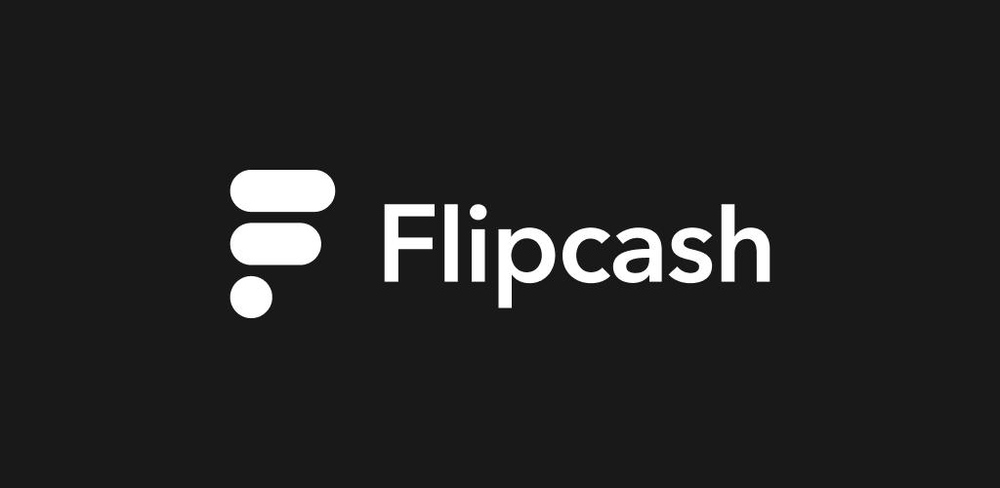
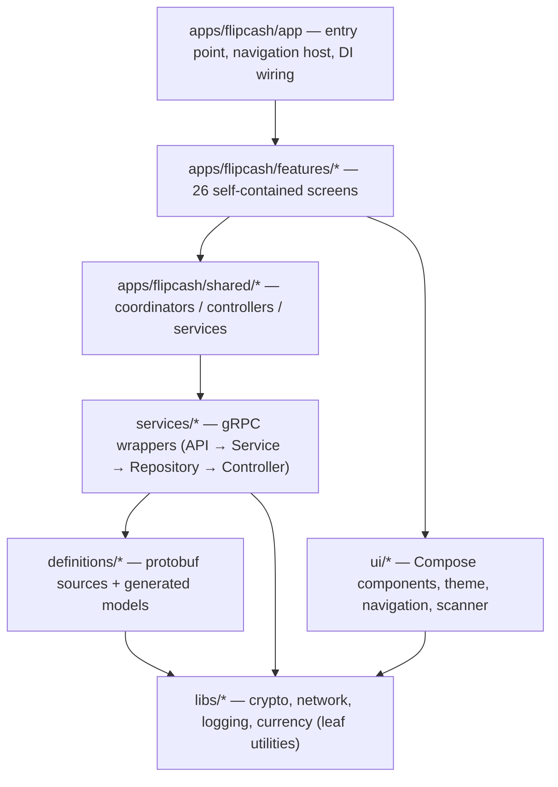

# Flipcash for Android

[](https://github.com/code-payments/code-android-app/releases/latest)
[](https://github.com/code-payments/code-android-app/blob/main/LICENSE.md)

**Flipcash** is a self-custodial mobile wallet for instant, global, private payments,
built on the open [Code Protocol](https://getcode.com) and the Solana blockchain. Its
base reserve currency is **USDF** (a USD stablecoin); on top of it, users create, buy,
sell, and share **launchpad currencies** — custom on-chain tokens backed by USDF
reserves (think memecoins backed by USDC). The signature interaction is a
**device-to-device cash bill**: one phone shows an animated circular **Kik Code**, a
second phone scans it, and a peer-to-peer handshake settles the payment.

> This repository is the **Android** client. Keys never leave the device — every
> transaction is signed locally with Ed25519 keys derived from a BIP39 mnemonic.

## Table of contents

- [Features](#features)
- [How it works](#how-it-works)
- [Architecture](#architecture)
- [Tech stack](#tech-stack)
- [Project structure](#project-structure)
- [Getting started](#getting-started)
- [Testing](#testing)
- [Documentation](#documentation)
- [Contributing](#contributing)
- [Community & support](#community--support)
- [License](#license)

## Features

- **Self-custodial wallet** — on-device keys, no custodian; USDF + launchpad currencies.
- **Device-to-device cash bills** — scan a Kik Code to send/receive in person.
- **Launchpad currencies** — create a USDF-backed token; buy/sell it against USDF via an on-chain bonding curve.
- **Contact & username sends**, remote send via shareable link, and in-app messaging.
- **Funding & withdrawal** — Coinbase on-ramp, in-app purchase, and on-chain USDC withdrawals.
- **Verified pricing** — every payment carries a cryptographically signed exchange-rate proof.

## How it works

- **USDF is the reserve currency.** Launchpad currencies are priced in and redeemable
  for USDF; USDF is locked in each currency's liquidity pool as backing.
- **Two gRPC backends.** The Flipcash service (accounts, profiles, chat, activity) and
  the Open Code Protocol / OCP service (transactions, intents, swaps, exchange rates).
- **Intents over Solana.** Money movement is expressed as signed *intents* submitted
  over a bidirectional `SubmitIntent` stream; the client builds and signs the Solana
  transactions locally, so the backend can verify rates and limits without ever holding
  the keys.

## Architecture

A multi-module Gradle project (**100+ modules**) with a strictly layered, acyclic
dependency graph. UI is Jetpack Compose (dark-mode only); dependencies are wired with
Hilt and surfaced to Compose through `CompositionLocal`.



The full architecture is documented in **[`docs/architecture/`](docs/architecture/README.md)** —
18 topic docs covering modules & boundaries, state & DI, navigation, networking,
persistence, payments, the design system, testing, and more.

## Tech stack

| Area | Choice |
|------|--------|
| Language / UI | Kotlin, Jetpack **Compose** (Material 3) |
| Navigation | Jetpack **Navigation 3** + a custom `CodeNavigator` |
| DI | **Hilt** + `CompositionLocal` |
| Async | Kotlin **Coroutines + Flow** (MVI via `BaseViewModel<State, Event>`) |
| Networking | **gRPC + Protobuf**; Retrofit/OkHttp for REST |
| Persistence | **Room** (per-user database) + DataStore |
| Crypto | **Ed25519**, BIP39 mnemonic/key derivation, **Solana** |
| Build | Gradle convention plugins, KSP, **Java 21** |

## Project structure

```
apps/flipcash/      Main app + feature (26) and shared modules
services/           gRPC clients: flipcash, opencode (+ Compose wrappers)
definitions/        Protobuf sources and generated models
libs/               Reusable utilities (crypto, network, logging, currency, …)
ui/                 Compose design system, navigation, scanner, biometrics
vendor/             Third-party SDKs (Kik scanner, OpenCV, TipKit)
build-logic/        Convention plugins for consistent module setup
docs/               Architecture documentation
```

Each service module has its own README: [`services/flipcash`](services/flipcash/README.md),
[`services/opencode`](services/opencode/README.md).

## Getting started

**Prerequisites**

- **JDK 21** (Amazon Corretto)
- Android SDK (compileSdk **37**, minSdk **29**)
- `google-services.json` placed at `apps/flipcash/app/src/`
- API keys in `local.properties` — `MIXPANEL_API_KEY`, `BUGSNAG_API_KEY`,
  `COINBASE_ONRAMP_API_KEY`, `GOOGLE_CLOUD_PROJECT_NUMBER` (a missing key won't fail
  the build, but disables the dependent feature)

**Build & run**

```bash
# Debug APK
./gradlew :apps:flipcash:app:assembleDebug

# Release bundle (AAB)
./gradlew :apps:flipcash:app:bundleRelease

# Unit tests (all modules)
./gradlew test
```

See **[docs/architecture/10-build-and-run.md](docs/architecture/10-build-and-run.md)**
for the full setup, build variants, and CI details.

## Testing

Fast JVM unit tests (Robolectric where Android APIs are needed), with `:libs:test-utils`
providing coroutine test helpers and Turbine for flow assertions. CI runs the unit
suite via Fastlane (`bundle exec fastlane android flipcash_tests`). See
**[docs/architecture/12-testing.md](docs/architecture/12-testing.md)**.

## Documentation

- **[Architecture suite](docs/architecture/README.md)** — the canonical guide (start here).
- **[Build & run](docs/architecture/10-build-and-run.md)** · **[Adding a feature](docs/architecture/11-adding-a-feature.md)** · **[Testing](docs/architecture/12-testing.md)**
- **[Glossary](docs/architecture/glossary.md)** — domain & architecture terms.
- **[`CLAUDE.md`](CLAUDE.md)** — repository orientation for contributors and AI agents.

## Contributing

Contributions are welcome via pull request.

- **Conventional commits** (`feat:`, `fix:`, `chore:`, optional scope e.g. `feat(oc):`).
- Default branch: **`code/cash`**; open PRs against it.
- CI runs on every PR (tests via Fastlane); please run `./gradlew test` locally first.

## Community & support

- **Website:** <https://flipcash.com>
- **X / Twitter:** <https://x.com/flipcash>
- **Support:** support@flipcash.com

## License

Released under the **MIT License** — see [LICENSE.md](LICENSE.md).
