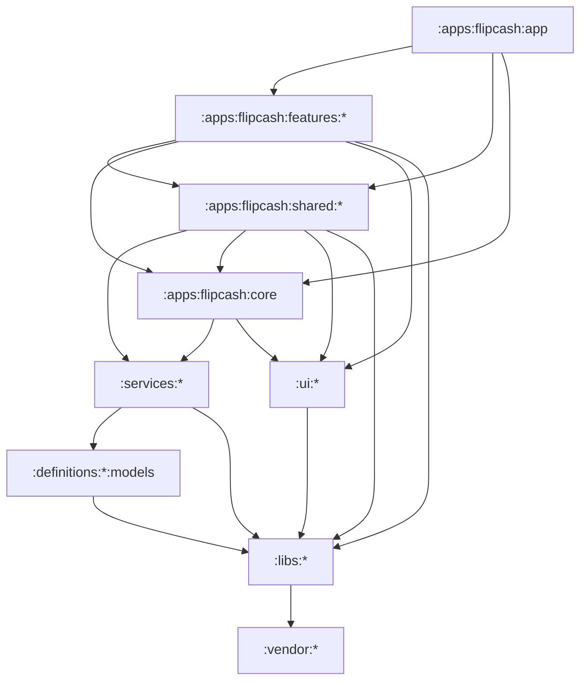

# 01 — Modules & boundaries

Flipcash Android is a multi-module Gradle project of roughly **132 modules**. The
module graph is the architecture: layering, ownership, and what may depend on what
are all enforced by where a module lives and which **convention plugin** it applies.
This document is the map.

## Module inventory

| Group | Path prefix | Count | Role |
|-------|-------------|-------|------|
| App | `:apps:flipcash:app` | 1 | Entry point — `FlipcashApp`, `MainActivity`, the navigation host, DI wiring. Assembles everything. |
| Core | `:apps:flipcash:core` | 1 | App-wide infrastructure: `AppRoute` graph, `Local*` composition locals, shared models. Auto-injected into every feature. |
| Features | `:apps:flipcash:features:*` | 26 | Self-contained screens (login, cash, balance, tokens, scanner, withdrawal, …). Each owns its state, ViewModels, and UI. |
| Shared | `:apps:flipcash:shared:*` | 34 | Cross-feature coordinators, controllers, and services (authentication, session, router, payments, persistence, …). Coordinators own a domain's cached, session-aware state; see [02 — Roles](02-state-and-dependency-injection.md#roles-coordinators-controllers-managers-services). |
| Services | `:services:*` | 4 | gRPC wrappers: `flipcash`, `flipcash-compose`, `opencode`, `opencode-compose`. |
| Definitions | `:definitions:*` | 4 | Protobuf sources (`*/protos`) and generated models (`*/models`) for Flipcash and OCP. |
| UI | `:ui:*` | 9 | Compose layer: `theme`, `components`, `core`, `resources`, `navigation`, `scanner`, `biometrics`, `emojis`, `testing`. |
| Libs | `:libs:*` | 21 | Leaf utilities: crypto/encryption, network, logging, currency, coroutines, permissions, locale, … |
| Vendor | `:vendor:*` | 3 | Third-party SDKs wrapped as modules: Kik scanner, OpenCV, TipKit. |

Every module is declared in [`settings.gradle.kts`](../../settings.gradle.kts).

## Dependency graph



*Arrows point to dependencies; the graph is acyclic.*

## Convention plugins

All modules apply a convention plugin from
[`build-logic/convention`](../../build-logic/convention/src/main/kotlin/) rather
than repeating Gradle config. There are four:

| Plugin | Source | Applies | Notable injected deps |
|--------|--------|---------|-----------------------|
| `flipcash.android.library` | `AndroidLibraryConventionPlugin.kt` | `com.android.library`, serialization, Java/Kotlin 21 toolchain, unit-test defaults | `timber`, `kotlinx-coroutines-core`, test utils |
| `flipcash.android.library.compose` | `AndroidLibraryComposeConventionPlugin.kt` | the base library plugin + Compose compiler | Compose BOM, `compose-ui`, `compose-foundation` |
| `flipcash.android.feature` | `AndroidFeatureConventionPlugin.kt` | the compose plugin + KSP + Hilt + Parcelize | see below |
| `flipcash.android.ed25519.shadow` | `AndroidEd25519ShadowConventionPlugin.kt` | shadow-jar handling for the Ed25519 native lib | used by `:services:opencode` |

### What the feature plugin gives you for free

`AndroidFeatureConventionPlugin` is the workhorse — every feature and most shared
modules use it. From
[`AndroidFeatureConventionPlugin.kt`](../../build-logic/convention/src/main/kotlin/AndroidFeatureConventionPlugin.kt):

```kotlin
"implementation"(libs.findBundle("hilt").get())
"ksp"(libs.findBundle("hilt-compiler").get())
"implementation"(libs.findBundle("compose").get())
"implementation"(libs.findLibrary("rinku-compose").get())

"implementation"(project(":libs:logging"))
"implementation"(project(":ui:core"))
"implementation"(project(":ui:components"))
"implementation"(project(":ui:navigation"))
"implementation"(project(":ui:resources"))
"implementation"(project(":ui:theme"))

if (path != ":apps:flipcash:core") {
    "implementation"(project(":apps:flipcash:core"))
}
```

So a feature module never declares Hilt, Compose, the UI layer, logging, or
`:apps:flipcash:core` by hand — it inherits them. Its `build.gradle.kts` only lists
the *additional* shared modules, libs, or sibling features it needs.

## The `public` / `impl` / `bindings` pattern

Several libs split into three modules so consumers depend on an interface, not an
implementation:

- `:libs:<name>:public` — pure API: interfaces and data classes, **no Hilt**.
- `:libs:<name>:impl` — the implementation, `api(public)`, Hilt bindings.
- `:libs:<name>:bindings` — composition layer: `implementation(impl)` +
  `api(public)`, re-exporting the API and wiring Hilt.

Consumers depend on `:bindings` and receive the API plus injection. Examples:
`:libs:locale:*`, `:libs:permissions:*`, `:libs:network:connectivity:*`,
`:libs:vibrator:*`.

## Boundary rules (enforced by convention)

1. **`ui/*` and `libs/*` never depend on app modules.** They may depend on other
   `ui/*` / `libs/*` and on external libraries only. `ui/components` knows about
   `libs/currency` and `ui/theme`, never about a feature.
2. **`libs/*` is leaf-level.** It may depend on other libs, `vendor/*`, and
   `definitions/*:models` (data only), but never on services or app modules.
3. **`services/*` wrap protobuf, nothing app-specific.** They depend on
   `definitions/*:models`, libs, and the gRPC runtime; they re-export public
   interfaces with `api(...)`. They never depend on features or shared modules.
4. **`definitions/*:models` is generated; don't hand-edit it.** Regenerate from the
   `.proto` sources in `definitions/*/protos`.
5. **Features may depend on shared modules, libs, ui, core, and (occasionally)
   other features** — e.g. `:features:login` pulls in `:features:purchase` for the
   onboarding hand-off. Keep cross-feature edges rare and acyclic.
6. **Shared modules depend on services, libs, ui, core, and each other** — never on
   features. This is where business logic that several features share lives.
7. **`:apps:flipcash:app` is the only universal collector.** It depends on every
   feature and the critical shared modules and assembles the graph.

## Why this matters

The plugin-injected baseline keeps modules uniform and small, the directory a
module lives in tells you its layer, and the acyclic graph means a change in a leaf
lib can't secretly reach back into a feature. New code almost never needs a new
convention plugin — pick the right directory and the right existing plugin, and the
boundaries enforce themselves.
