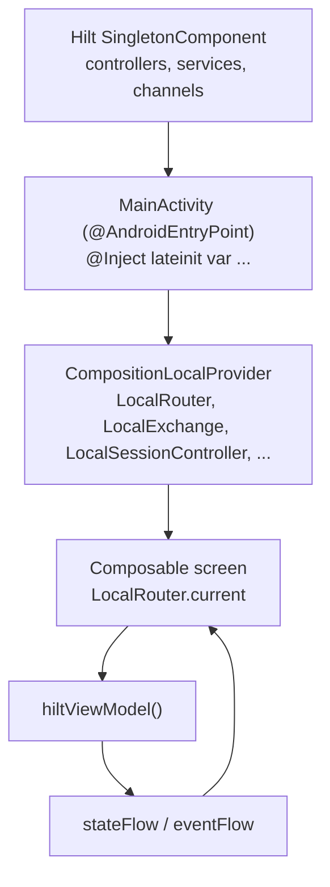

# 02 — State & dependency injection

Two patterns dominate how Flipcash wires dependencies and manages UI state:
**Hilt** provides singletons and ViewModels at the object-graph level, and a
**CompositionLocal** layer re-exposes the long-lived controllers to the Compose
tree so screens read them as ambient values instead of injecting each one. State
itself flows through a small MVI base class, `BaseViewModel<State, Event>`.



## Hilt setup

The application class
[`FlipcashApp`](../../apps/flipcash/app/src/main/kotlin/com/flipcash/app/FlipcashApp.kt)
is annotated `@HiltAndroidApp`. Bindings are organized into `@Module` objects, each
`@InstallIn(SingletonComponent::class)`, living next to the thing they provide
(e.g. `services/flipcash/.../inject/FlipcashModule.kt`,
`apps/flipcash/shared/router/.../inject/RouterModule.kt`,
`apps/flipcash/shared/session/.../inject/`). Most app-level dependencies are
`@Singleton`; ViewModels use `@HiltViewModel` (activity-retained scope). Custom
qualifiers disambiguate same-typed bindings — for example
`@FlipcashManagedChannel` vs `@FlipcashManagedStreamingChannel` for the two gRPC
channels (see [04 — Networking](04-networking.md)).

## The CompositionLocal injection pattern

Rather than `@Inject`-ing a dozen controllers into every screen,
[`MainActivity`](../../apps/flipcash/app/src/main/kotlin/com/flipcash/app/MainActivity.kt)
injects them once and republishes them through a `CompositionLocalProvider`:

```kotlin
@AndroidEntryPoint
class MainActivity : FragmentActivity() {
    @Inject lateinit var router: Router
    @Inject lateinit var userManager: UserManager
    @Inject lateinit var sessionController: SessionController
    @Inject lateinit var exchange: Exchange
    // ... ~20 injected controllers/services

    override fun onCreate(savedInstanceState: Bundle?) {
        // ...
        setContent {
            CompositionLocalProvider(
                LocalRouter provides router,
                LocalUserManager provides userManager,
                LocalSessionController provides sessionController,
                LocalExchange provides exchange,
                // ... LocalShareController, LocalFeatureFlags, LocalToastController, etc.
            ) {
                ProvidePermissionChecker(permissionChecker) {
                    Rinku { App(tipsEngine = tipsEngine) }
                }
            }
        }
    }
}
```

Each `Local*` is a `staticCompositionLocalOf` declared next to the type it carries,
so the dependency and its ambient handle live together. For example
[`Router.kt`](../../apps/flipcash/shared/router/src/main/kotlin/com/flipcash/app/router/Router.kt):

```kotlin
val LocalRouter = staticCompositionLocalOf<Router?> { null }
```

Representative composition locals and where they're defined:

| Local | Type | Defined in |
|-------|------|-----------|
| `LocalRouter` | `Router` | `shared/router/.../Router.kt` |
| `LocalSessionController` | `SessionController` | `shared/session/.../SessionController.kt` |
| `LocalUserManager` | `UserManager` | `apps/flipcash/core/.../Locals.kt` |
| `LocalExchange` | `Exchange` | `services/opencode-compose/.../LocalExchange` |
| `LocalFeatureFlags` | `FeatureFlagController` | `shared/featureflags/.../FeatureFlagController.kt` |
| `LocalToastController` | `ToastController` | `apps/flipcash/core/.../toast/ToastController.kt` |
| `LocalNetworkObserver` | `NetworkConnectivityListener` | `libs/network/connectivity/...` |

A screen then reads `val session = LocalSessionController.current` instead of
taking it as a constructor parameter. Hilt still owns the lifecycle and singleton
identity — CompositionLocal is purely the delivery mechanism into Compose.

> **When to use which.** Inject **per-screen** dependencies through the ViewModel
> constructor (`@HiltViewModel`). Reach for a **`Local*`** only for the long-lived,
> app-wide controllers that `MainActivity` already provides.

## Roles: coordinators, controllers, managers, services

The injected dependencies above carry recurring suffixes — `Coordinator`,
`Controller`, `Manager`, `Service` — and they are **not interchangeable**. Each
names a specific role:

| Role | Responsibility | Lives in | Exposes |
|------|----------------|----------|---------|
| **Coordinator** | The **single source of truth for a domain** (contacts, tokens, chat, settings, activity feed). Wraps one or more stateless Controllers and adds **caching (memory + Room), persistence, and sync/consistency**. **Session- and lifecycle-aware.** | `apps/flipcash/shared/*` | `StateFlow` domain state; usually `: SessionListener, DefaultLifecycleObserver` |
| **Controller** | A domain/feature API. Service-layer controllers are often **stateless network gateways** (no caching/state); app-layer controllers expose light UI-facing state/actions. | `services/*/controllers/*`, `apps/flipcash/shared/*` | `suspend` actions + `Result<T>`, or light `StateFlow` |
| **Manager** | Owns a **state machine or resource lifecycle** (auth flow, credential storage), coordinating side effects across coordinators/controllers. | `services/*`, `apps/flipcash/shared/*` | `StateFlow` of a lifecycle/auth state (e.g. `UserManager` → `AuthState`) |
| **Service** | The **internal gRPC/REST adapter** — translates network responses to domain models. Never exposed to the UI. | `services/*/internal/network/services/*` | `Result<T>` of domain models |

### Coordinator vs Controller, by example

The cleanest illustration is tokens. `TokenController`
(`services/opencode/.../controllers/TokenController.kt`) describes itself in its
own KDoc as a **stateless network gateway**:

> *"This controller provides direct access to token-related network APIs without
> any caching, persistence, or state management… usable both within the Flipcash
> app (wrapped by `TokenCoordinator`) and as part of a standalone public SDK. All
> state management (caching, persistence, lifecycle, balance tracking) is the
> responsibility of the consumer."*

That consumer is the **Coordinator**. `TokenCoordinator`
(`apps/flipcash/shared/tokens/.../TokenCoordinator.kt`) wraps the controller,
implements `SessionListener, DefaultLifecycleObserver`, holds `StateFlow` state, and
serves reads from a **Memory → Room → network** cache — rehydrating on login and
reacting to foreground/background. `ContactCoordinator`
(`apps/flipcash/shared/contacts/.../ContactCoordinator.kt`) follows the same shape,
syncing device contacts ↔ persistence ↔ server. So: **a Controller is the stateless
domain API; a Coordinator is the stateful, session-aware owner of that domain's
cached state.** When in doubt, [09 — Separation of concerns](09-separation-of-concerns.md)
has a "where does this code go?" table.

## Delegate composition: `SessionController`

The `SessionController` interface is split into four sub-interfaces —
`BillOperations`, `CodeScanOperations`, `CashLinkOperations`, `DepositOperations` —
plus lifecycle methods. `RealSessionController` implements each sub-interface via
Kotlin `by` delegation to a focused `@Singleton` delegate:

```kotlin
class RealSessionController @Inject constructor(
    private val billDelegate: BillPresentationDelegate,
    private val scanDelegate: CodeScanDelegate,
    private val cashLinkDelegate: CashLinkDelegate,
    private val depositDelegate: DepositDelegate,
    private val giftCardDelegate: GiftCardSharingDelegate,
    private val stateHolder: SessionStateHolder,
    // ... remaining deps for lifecycle/polling
) : SessionController,
    BillOperations by billDelegate,
    CodeScanOperations by scanDelegate,
    CashLinkOperations by cashLinkDelegate,
    DepositOperations by depositDelegate { ... }
```

Each delegate owns its own `CoroutineScope`, dependencies, and logic. Cross-delegate
communication uses event flows — each delegate exposes a `Flow<Event>` (backed by a
`Channel(UNLIMITED)` for guaranteed delivery), and
the shell's `init` block collects them and routes events:

```kotlin
// In RealSessionController init:
billDelegate.events.onEach { event ->
    when (event) {
        is BillPresentationDelegate.Event.SendAsLinkRequested ->
            giftCardDelegate.shareGiftCard(event.bill, event.owner)
        is BillPresentationDelegate.Event.RefreshFeed ->
            bringActivityFeedCurrent()
    }
}.launchIn(scope)
```

A shared `SessionStateHolder` (wrapping `MutableStateFlow<SessionState>`) is injected
into every delegate so they all read/write the same session state without holding the
raw mutable flow. Lifecycle orchestration (`onAppInForeground`/`onAppInBackground`) and
flow observers (auth state, feature flags, network reconnects) remain on the shell
because they are inherently cross-cutting.

The relevant source files live under `apps/flipcash/shared/session/.../internal/`:
`SessionStateHolder.kt`, and in the `delegates/` sub-package:
`BillPresentationDelegate.kt`, `CodeScanDelegate.kt`, `CashLinkDelegate.kt`,
`DepositDelegate.kt`, `GiftCardSharingDelegate.kt`. The shell is `RealSessionController.kt`.

## State: `BaseViewModel<State, Event>`

The MVI base class lives at
[`BaseViewModel.kt`](../../ui/navigation/src/main/kotlin/com/getcode/view/BaseViewModel.kt):

```kotlin
abstract class BaseViewModel<ViewState : Any, Event : Any>(
    initialState: ViewState,
    private val updateStateForEvent: (Event) -> (ViewState.() -> ViewState),
    private val defaultDispatcher: CoroutineContext = Dispatchers.Default,
) : ViewModel() {

    private val _eventFlow = MutableSharedFlow<Event>()
    val eventFlow: SharedFlow<Event> = _eventFlow.asSharedFlow()

    private val _stateFlow = MutableStateFlow(initialState)
    val stateFlow: StateFlow<ViewState> = _stateFlow.asStateFlow()

    fun dispatchEvent(event: Event) {
        setState(updateStateForEvent(event))     // synchronous reducer
        viewModelScope.launch(defaultDispatcher) {
            _eventFlow.emit(event)                // async side-effect channel
        }
    }
}
```

The contract for every concrete ViewModel:

- **State** — an immutable `data class` describing the screen.
- **Event** — a `sealed interface` of user actions and system signals.
- **Reducer** — `updateStateForEvent`, a pure `(Event) -> (State.() -> State)`
  function (conventionally a `companion object val`) that maps each event to a state
  transform. It runs synchronously inside `dispatchEvent`.
- **Side effects** — collected off `eventFlow` in the `init` block, using Flow
  operators (`filterIsInstance<…>()`, `onEach`, `flatMapLatest`, `combine`,
  `launchIn(viewModelScope)`) to react to events and external `StateFlow`s.

A representative implementation is
[`CashScreenViewModel`](../../apps/flipcash/features/cash/src/main/kotlin/com/flipcash/app/cash/internal/CashScreenViewModel.kt),
which combines token, balance, and exchange-rate flows into its `State` and emits a
`PresentBill` event that the screen consumes to show a cash bill.

`BaseViewModel.kt` also ships `LoadingSuccessState` (`loading` / `success` / `error`
with an `Idle` default) for the common async-status pattern.

## Consuming state in Compose

```kotlin
@Composable
fun CashScreen(/* args */) {
    val session = LocalSessionController.current!!          // ambient controller
    val viewModel = hiltViewModel<CashScreenViewModel>()    // Hilt-built VM
    val state by viewModel.stateFlow.collectAsStateWithLifecycle()

    LaunchedEffect(viewModel) {
        viewModel.eventFlow
            .filterIsInstance<CashScreenViewModel.Event.PresentBill>()
            .onEach { session.showBill(it.bill) }
            .launchIn(this)
    }
    // render from `state`, send Event via viewModel.dispatchEvent(...)
}
```

`stateFlow` is collected lifecycle-aware for rendering; `eventFlow` is collected in
a `LaunchedEffect` for one-shot side effects (navigation, showing a bill, toasts).
This keeps rendering a pure function of `state` while side effects stay explicit.
