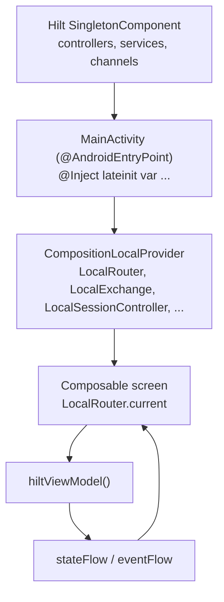

# 02 — State & dependency injection

Two patterns dominate how Flipcash wires dependencies and manages UI state:
**Hilt** provides singletons and ViewModels at the object-graph level, and a
**CompositionLocal** layer re-exposes the long-lived controllers to the Compose
tree so screens read them as ambient values instead of injecting each one. State
itself flows through a small MVI base class, `BaseViewModel<State, Event>`.



## Hilt setup

The application class
[`FlipcashApp`](../../apps/flipcash/app/src/main/kotlin/com/flipcash/app/FlipcashApp.kt)
is annotated `@HiltAndroidApp`. Bindings are organized into `@Module` objects, each
`@InstallIn(SingletonComponent::class)`, living next to the thing they provide
(e.g. `services/flipcash/.../inject/FlipcashModule.kt`,
`apps/flipcash/shared/router/.../inject/RouterModule.kt`,
`apps/flipcash/shared/session/.../inject/`). Most app-level dependencies are
`@Singleton`; ViewModels use `@HiltViewModel` (activity-retained scope). Custom
qualifiers disambiguate same-typed bindings — for example
`@FlipcashManagedChannel` vs `@FlipcashManagedStreamingChannel` for the two gRPC
channels (see [04 — Networking](04-networking.md)).

## The CompositionLocal injection pattern

Rather than `@Inject`-ing a dozen controllers into every screen,
[`MainActivity`](../../apps/flipcash/app/src/main/kotlin/com/flipcash/app/MainActivity.kt)
injects them once and republishes them through a `CompositionLocalProvider`:

```kotlin
@AndroidEntryPoint
class MainActivity : FragmentActivity() {
    @Inject lateinit var router: Router
    @Inject lateinit var userManager: UserManager
    @Inject lateinit var sessionController: SessionController
    @Inject lateinit var exchange: Exchange
    // ... ~20 injected controllers/services

    override fun onCreate(savedInstanceState: Bundle?) {
        // ...
        setContent {
            CompositionLocalProvider(
                LocalRouter provides router,
                LocalUserManager provides userManager,
                LocalSessionController provides sessionController,
                LocalExchange provides exchange,
                // ... LocalShareController, LocalFeatureFlags, LocalToastController, etc.
            ) {
                ProvidePermissionChecker(permissionChecker) {
                    Rinku { App(tipsEngine = tipsEngine) }
                }
            }
        }
    }
}
```

Each `Local*` is a `staticCompositionLocalOf` declared next to the type it carries,
so the dependency and its ambient handle live together. For example
[`Router.kt`](../../apps/flipcash/shared/router/src/main/kotlin/com/flipcash/app/router/Router.kt):

```kotlin
val LocalRouter = staticCompositionLocalOf<Router?> { null }
```

Representative composition locals and where they're defined:

| Local | Type | Defined in |
|-------|------|-----------|
| `LocalRouter` | `Router` | `shared/router/.../Router.kt` |
| `LocalSessionController` | `SessionController` | `shared/session/.../SessionController.kt` |
| `LocalUserManager` | `UserManager` | `apps/flipcash/core/.../Locals.kt` |
| `LocalExchange` | `Exchange` | `services/opencode-compose/.../LocalExchange` |
| `LocalFeatureFlags` | `FeatureFlagController` | `shared/featureflags/.../FeatureFlagController.kt` |
| `LocalToastController` | `ToastController` | `apps/flipcash/core/.../toast/ToastController.kt` |
| `LocalNetworkObserver` | `NetworkConnectivityListener` | `libs/network/connectivity/...` |

A screen then reads `val session = LocalSessionController.current` instead of
taking it as a constructor parameter. Hilt still owns the lifecycle and singleton
identity — CompositionLocal is purely the delivery mechanism into Compose.

> **When to use which.** Inject **per-screen** dependencies through the ViewModel
> constructor (`@HiltViewModel`). Reach for a **`Local*`** only for the long-lived,
> app-wide controllers that `MainActivity` already provides.

## State: `BaseViewModel<State, Event>`

The MVI base class lives at
[`BaseViewModel.kt`](../../ui/navigation/src/main/kotlin/com/getcode/view/BaseViewModel.kt):

```kotlin
abstract class BaseViewModel<ViewState : Any, Event : Any>(
    initialState: ViewState,
    private val updateStateForEvent: (Event) -> (ViewState.() -> ViewState),
    private val defaultDispatcher: CoroutineContext = Dispatchers.Default,
) : ViewModel() {

    private val _eventFlow = MutableSharedFlow<Event>()
    val eventFlow: SharedFlow<Event> = _eventFlow.asSharedFlow()

    private val _stateFlow = MutableStateFlow(initialState)
    val stateFlow: StateFlow<ViewState> = _stateFlow.asStateFlow()

    fun dispatchEvent(event: Event) {
        setState(updateStateForEvent(event))     // synchronous reducer
        viewModelScope.launch(defaultDispatcher) {
            _eventFlow.emit(event)                // async side-effect channel
        }
    }
}
```

The contract for every concrete ViewModel:

- **State** — an immutable `data class` describing the screen.
- **Event** — a `sealed interface` of user actions and system signals.
- **Reducer** — `updateStateForEvent`, a pure `(Event) -> (State.() -> State)`
  function (conventionally a `companion object val`) that maps each event to a state
  transform. It runs synchronously inside `dispatchEvent`.
- **Side effects** — collected off `eventFlow` in the `init` block, using Flow
  operators (`filterIsInstance<…>()`, `onEach`, `flatMapLatest`, `combine`,
  `launchIn(viewModelScope)`) to react to events and external `StateFlow`s.

A representative implementation is
[`CashScreenViewModel`](../../apps/flipcash/features/cash/src/main/kotlin/com/flipcash/app/cash/internal/CashScreenViewModel.kt),
which combines token, balance, and exchange-rate flows into its `State` and emits a
`PresentBill` event that the screen consumes to show a cash bill.

`BaseViewModel.kt` also ships `LoadingSuccessState` (`loading` / `success` / `error`
with an `Idle` default) for the common async-status pattern.

## Consuming state in Compose

```kotlin
@Composable
fun CashScreen(/* args */) {
    val session = LocalSessionController.current!!          // ambient controller
    val viewModel = hiltViewModel<CashScreenViewModel>()    // Hilt-built VM
    val state by viewModel.stateFlow.collectAsStateWithLifecycle()

    LaunchedEffect(viewModel) {
        viewModel.eventFlow
            .filterIsInstance<CashScreenViewModel.Event.PresentBill>()
            .onEach { session.showBill(it.bill) }
            .launchIn(this)
    }
    // render from `state`, send Event via viewModel.dispatchEvent(...)
}
```

`stateFlow` is collected lifecycle-aware for rendering; `eventFlow` is collected in
a `LaunchedEffect` for one-shot side effects (navigation, showing a bill, toasts).
This keeps rendering a pure function of `state` while side effects stay explicit.
