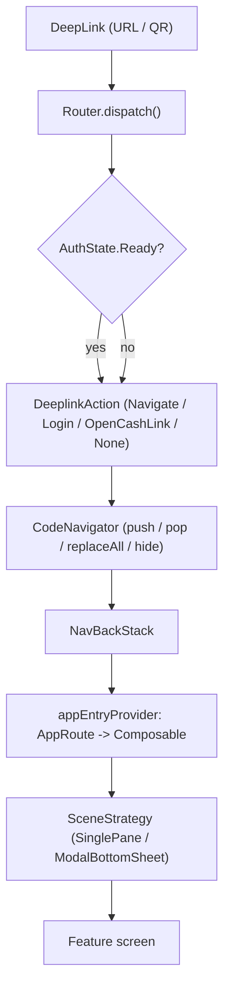

# 03 — Navigation

> **Note on stacks:** Flipcash navigates with **Jetpack Navigation 3**
> (`androidx.navigation3`) wrapped by a custom `CodeNavigator`. There is **no
> Voyager** dependency in the project.

Navigation has three moving parts: a **typed route graph** (`AppRoute`), a
**navigator** that drives a Navigation3 back stack (`CodeNavigator` +
`AppNavHost`), and a **`Router`** that turns external deeplinks into navigation
actions, gated by auth state.



## The route graph: `AppRoute`

Routes are a serializable, parcelable sealed hierarchy in
[`AppRoute.kt`](../../apps/flipcash/core/src/main/kotlin/com/flipcash/app/core/AppRoute.kt).
Every route is a Navigation3 `NavKey`:

```kotlin
@Serializable
@Parcelize
sealed interface AppRoute : NavKey, Parcelable {

    @Serializable @Parcelize
    data object Loading : AppRoute

    @Serializable @Parcelize
    data class OnboardingFlow(
        val phase: Phase = Phase.Account,
        val seed: String? = null,
        val resumeAt: ResumePoint = ResumePoint.Login,
        // ...
    ) : AppRoute, FlowRoute {
        override val initialStack: List<NavKey> get() = /* steps for this phase */
    }

    sealed interface Token : AppRoute { /* Info, Swap, ... */ }
    sealed interface Transfers : AppRoute { /* Deposit, Withdrawal */ }
    sealed interface Messaging : AppRoute { /* Chat */ }
    // Onboarding, Main, Sheets, Menu, ...
}
```

Two marker interfaces from `com.getcode.navigation.flow` model multi-screen flows:

- **`FlowRoute`** — a route that expands into an `initialStack` of inner steps
  (e.g. `OnboardingFlow` → `OnboardingStep.Start`, `…AccessKey`, `…Purchase`).
- **`FlowRouteWithResult<T>`** — a flow that returns a typed result to its caller
  (e.g. `Token.Swap` → `SwapResult`, `Transfers.Deposit` → `DepositResult`).

Because routes are `@Serializable` + `@Parcelize`, the back stack survives process
death and deeplinks can be expressed as route lists.

## The navigator and host

The root composable
[`App.kt`](../../apps/flipcash/app/src/main/kotlin/com/flipcash/app/internal/ui/App.kt)
creates the back stack and navigator and hosts the graph:

```kotlin
val backStack = remember { NavBackStack<NavKey>(AppRoute.Loading) }
val codeNavigator = rememberCodeNavigator(backStack = backStack, /* ... */)

CompositionLocalProvider(LocalCodeNavigator provides codeNavigator) {
    AppNavHost(
        navigator = codeNavigator,
        sceneStrategies = listOf(
            ModalBottomSheetSceneStrategy(/* ... */),
            SinglePaneSceneStrategy(),
        ),
        entryProvider = appEntryProvider(/* ... */),
    )
}
```

- **`CodeNavigator`** (`com.getcode.navigation.core`, in `:ui:navigation`) is the
  public navigation API. Screens obtain it via `LocalCodeNavigator.current` and call
  `push(route)`, `push(routes)`, `pop()`, `replaceAll(routes)`, and `hide()` (to
  dismiss a bottom sheet).
- **Scene strategies** decide presentation: `SinglePaneSceneStrategy` for
  full-screen content, `ModalBottomSheetSceneStrategy` for sheets.
- **`appEntryProvider`** maps each `AppRoute` to its composable.

## Registering screens

Each feature exports its screen composable; the app wires routes to screens in one
place,
[`AppScreenContent.kt`](../../apps/flipcash/app/src/main/kotlin/com/flipcash/app/internal/ui/navigation/AppScreenContent.kt),
via an `entryProvider { … }` builder:

```kotlin
fun appEntryProvider(/* ... */): (NavKey) -> NavEntry<NavKey> = entryProvider {
    annotatedEntry<AppRoute.Loading> { MainRoot(/* ... */) }
    annotatedEntry<AppRoute.OnboardingFlow> { key -> OnboardingFlowScreen(route = key, /* ... */) }
    annotatedEntry<AppRoute.Sheets.Give> { key -> CashScreen(key.mint, key.fromTokenInfo) }
    annotatedEntry<AppRoute.Token.Info> { key -> TokenInfoScreen(mint = key.mint) }
    annotatedEntry<AppRoute.Token.Swap> { key -> SwapFlowScreen(route = key, /* ... */) }
    annotatedEntry<AppRoute.Transfers.Withdrawal> { key -> WithdrawalFlowScreen(route = key, /* ... */) }
    annotatedEntry<AppRoute.Messaging.Chat> { key -> ChatFlowScreen(route = key, /* ... */) }
    // ...
}
```

Features stay self-contained (own screens, ViewModels, Hilt modules); all routes
converge here. Adding a screen means: define the `AppRoute`, export the composable
from the feature, and register one `annotatedEntry`.

## Deeplinks: the `Router`

The [`Router`](../../apps/flipcash/shared/router/src/main/kotlin/com/flipcash/app/router/Router.kt)
interface has two jobs:

```kotlin
interface Router {
    /** Parse + classify + resolve routes in one call. Called once per deeplink. */
    fun dispatch(deepLink: DeepLink): DeeplinkAction
    /** Classify a URL (for QR scanning) without resolving routes. */
    fun classify(deepLink: DeepLink): DeeplinkType?
}
```

`AppRouter` (the implementation, in `router/internal/`) classifies the URL into a
`DeeplinkType` (`Login`, `CashLink`, `TokenInfo`, `Chat`, …) and then **gates on
auth**: unauthenticated users are redirected into onboarding; authenticated users
get the real `DeeplinkAction` (`Navigate(routes)`, `Login(entropy)`,
`OpenCashLink(entropy)`, or `None`). Deeplink intake itself is handled by **Rinku**
(`dev.theolm.rinku`), wired in `MainActivity`; `App.kt` observes the incoming link
and feeds it to `router.dispatch(...)`, then pushes the resulting routes onto the
navigator.

## Why this matters

Typed `NavKey` routes give compile-time-checked navigation and free state
restoration; the single `appEntryProvider` keeps feature modules decoupled from one
another; and routing all external links through `Router` means **auth gating lives
in exactly one place** instead of being re-checked on every screen.
