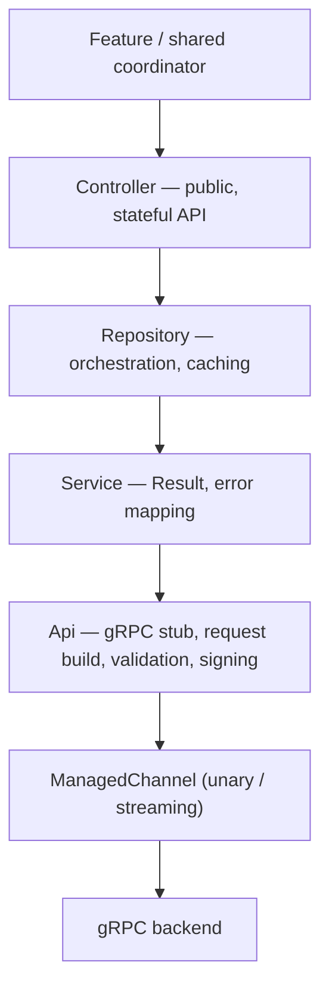

# 04 — Networking

Flipcash talks to two **gRPC** backends — the Flipcash service (accounts,
profiles, chat, activity) and the Open Code Protocol / OCP service (transactions,
intents, exchange rates) — plus a little **REST** for the Coinbase on-ramp. The
gRPC code is organized as a strict four-layer stack so that protobuf details never
leak up into features.



## The four layers

For both `:services:flipcash` and `:services:opencode`:

| Layer | Location | Responsibility |
|-------|----------|----------------|
| **Api** | `…/internal/network/api/` | Holds the generated gRPC stub, builds requests, validates them (`protovalidate`), signs/authenticates, returns raw protobuf. E.g. `AccountApi`, `TransactionApi`. |
| **Service** | `…/internal/network/services/` | Wraps an Api, converts responses to `Result<T>`, maps RPC/status errors to typed domain errors (e.g. `RegisterError.InvalidSignature`). E.g. `AccountService`. |
| **Repository** | `…/internal/repositories/` (or `…/repositories/`) | Coordinates one or more services, applies caching, exposes suspend functions / flows. E.g. `InternalAccountRepository`, `TransactionRepository`. |
| **Controller** | `…/controllers/` | The public, often stateful API features consume. Holds `StateFlow`s, pulls key material from `UserManager`. E.g. `AccountController`, `TransactionController`. |

The `*-compose` modules (`:services:flipcash-compose`, `:services:opencode-compose`)
add Compose-facing bindings — for example `LocalExchange`, the composition local
that surfaces exchange rates to the UI.

## Managed channels

Each service module provides **two** gRPC channels via Hilt, distinguished by
qualifier — see
[`FlipcashModule.kt`](../../services/flipcash/src/main/kotlin/com/flipcash/services/inject/FlipcashModule.kt):

```kotlin
@Provides @FlipcashManagedChannel
fun provideManagedChannel(/* context, config */): ManagedChannel =
    AndroidChannelBuilder
        .usingBuilder(OkHttpChannelBuilder.forAddress(config.baseUrl, config.port))
        .keepAliveWithoutCalls(false)
        .intercept(LoggingClientInterceptor())
        .build()

@Provides @FlipcashManagedStreamingChannel
fun provideManagedStreamingChannel(/* ... */): ManagedChannel =
    AndroidChannelBuilder
        .usingBuilder(OkHttpChannelBuilder.forAddress(config.baseUrl, config.port))
        .keepAliveTime(config.keepAlive.inWholeMilliseconds, TimeUnit.MILLISECONDS)
        .keepAliveTimeout(config.keepAliveTimeout.inWholeMilliseconds, TimeUnit.MILLISECONDS)
        .keepAliveWithoutCalls(true)   // held open for bidirectional streams
        .intercept(LoggingClientInterceptor())
        .build()
```

- The **unary** channel is for request/response RPCs; the **streaming** channel
  keeps a keep-alive open for long-lived bidirectional streams.
- `@OpenCodeManagedChannel` / `@OpenCodeManagedStreamingChannel` mirror this in the
  OCP module against its own base URL.
- `LoggingClientInterceptor` traces every call (see
  [08 — Cross-cutting concerns](08-cross-cutting-concerns.md)).

## Signing & authentication

Requests are signed with the owner's **Ed25519** key. Builder extensions in
`services/flipcash/.../internal/network/extensions/` add the signature/auth fields
before send:

```kotlin
// SignMessage.kt — sign the serialized message
fun <M, B> GeneratedMessageLite.Builder<M, B>.sign(owner: Ed25519.KeyPair): Common.Signature {
    val bytes = buildPartial().toByteArray()
    return Ed25519.sign(bytes, owner).asSignature()
}

// AuthenticateMessage.kt — attach pubkey + signature as Common.Auth
fun <M, B> GeneratedMessageLite.Builder<M, B>.authenticate(owner: Ed25519.KeyPair): Common.Auth { /* ... */ }
```

Companion `LocalToProtobuf` / `ProtobufToLocal` extensions translate between domain
models (keys, token amounts, timestamps) and their protobuf representations at the
Api boundary.

## Streaming: `SubmitIntent`

Payments use a **bidirectional stream**. `TransactionApi.submitIntent` takes a
`Flow<SubmitIntentRequest>` and returns a `Flow<SubmitIntentResponse>`; the
client/server handshake is:

1. Client sends `SubmitActions` (the intent + actions).
2. Server validates and returns `ServerParameters`.
3. Client builds the Solana transactions locally and signs them.
4. Client sends `SubmitSignatures`.
5. Server verifies and returns `Success`.

The full handshake and the intent types are covered in
[06 — Payments & operations](06-payments-and-operations.md).

## REST, JWT & the Coinbase on-ramp

The Coinbase on-ramp uses Retrofit. `CoinbaseApi`
(`libs/network/coinbase/onramp/...`) declares `@POST`/`@GET` endpoints that take an
`@Header("Authorization")` JWT and dynamic `@Url`s. JWTs are minted per endpoint by
`JwtProvider` (`libs/network/jwt/...`):

```kotlin
interface JwtProvider {
    suspend fun provideJwtForEndpoint(apiKey: String, endpoint: JwtSecuredEndpoint): Result<Jwt>
}
```

Tokens are short-lived and passed per request.

## Exchange rates & connectivity

- **Exchange** (`libs/network/exchange/.../Exchange.kt`, implemented by
  `OpenCodeExchange`) exposes current and observable rates as Flows
  (`observeLocalRate()`, `observeRates()`, `fetchRatesIfNeeded()`) and is surfaced
  to Compose as `LocalExchange`. All transfers verify a cryptographically-signed
  exchange rate.
- **Connectivity** (`libs/network/connectivity/...`, `Api24NetworkObserver`)
  watches `ConnectivityManager` via a `callbackFlow`, `debounce(2000)`s WiFi↔mobile
  transitions, and `shareIn`s a single connectivity flow. It's published app-wide as
  `LocalNetworkObserver`.

## Why this matters

The four-layer split means a proto or transport change is absorbed at the Api/
Service boundary and never ripples into a feature. Features depend only on
**controllers**, which speak in domain types and `Result<T>`, not in gRPC stubs.
