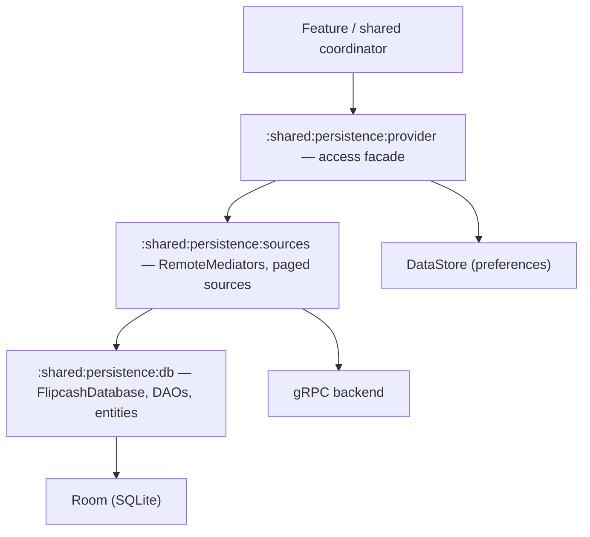

# 05 — Persistence

Local state lives in a **Room** database, with **DataStore** for lightweight
key/value preferences and a **Paging 3 `RemoteMediator`** layer to back paged lists
(activity feed, chat) from the network. The persistence layer is split into three
shared sub-modules so storage details don't leak into features.

> **Note on encryption:** the Flipcash Room database is **not** wrapped with
> SQLCipher today (there is no `SupportFactory` / `net.zetetic` in
> `apps/flipcash/shared/persistence`). Instead, **each account gets its own
> database file**, named from the account entropy. Older notes describing a
> SQLCipher-encrypted Room DB are stale.



## Sub-modules

| Module | Role |
|--------|------|
| `:apps:flipcash:shared:persistence:db` | The Room `FlipcashDatabase`, entities, DAOs, type converters, migrations. |
| `:apps:flipcash:shared:persistence:sources` | Paging `RemoteMediator`s and data sources that bridge network ↔ database. |
| `:apps:flipcash:shared:persistence:provider` | The injected facade features use to reach DAOs/DataStore without depending on Room directly. |

## The database

[`FlipcashDatabase`](../../apps/flipcash/shared/persistence/db/src/main/kotlin/com/flipcash/app/persistence/FlipcashDatabase.kt)
is a standard Room `@Database` (currently **version 20**) with a long chain of
`@AutoMigration`s and `@TypeConverters` for token and chat payloads:

```kotlin
@Database(
    entities = [
        MessageEntity::class, TokenEntity::class, SocialLinkEntity::class,
        TokenValuationEntity::class, CurrencyCreatorDraftEntity::class,
        ContactSyncStateEntity::class, ContactMappingEntity::class,
        ChatMetadataEntity::class, ChatMessageEntity::class, ChatMemberEntity::class,
    ],
    autoMigrations = [ /* 1->2 ... 19->20 */ ],
    version = 20,
)
@TypeConverters(TokenTypeConverters::class, ChatTypeConverters::class)
abstract class FlipcashDatabase : RoomDatabase() {
    abstract fun messageDao(): MessageDao
    abstract fun tokenDao(): TokenDao
    abstract fun contactDao(): ContactDao
    abstract fun chatMetadataDao(): ChatMetadataDao
    abstract fun chatMessageDao(): ChatMessageDao
    abstract fun chatMemberDao(): ChatMemberDao
    abstract fun currencyCreatorDraftDao(): CurrencyCreatorDraftDao
    // ...
}
```

### Per-user database naming

The database is opened with a name derived from the signed-in account's entropy, so
each user gets an isolated file and switching accounts can't cross-contaminate
cached state:

```kotlin
fun init(context: Context, entropyB64: String) {
    val dbUniqueName = Base58.encode(entropyB64.toByteArray().subByteArray(0, 6))
    dbName = "$dbNamePrefix-$dbUniqueName.db"          // e.g. fcash_database-<base58>.db
    instance = Room.databaseBuilder(context, FlipcashDatabase::class.java, dbName)
        .fallbackToDestructiveMigration()
        .build()
}
```

Room schema JSON is checked in under
`apps/flipcash/shared/persistence/db/schemas/` to keep migrations honest.

## DAOs & paged sources

DAOs (`…/persistence/dao/`) expose suspend functions and `Flow`s for reads;
mutations are suspend. Paged lists are populated by `RemoteMediator`s in the
`sources` module — e.g. a feed mediator and a chat-message mediator — which fetch
pages from the backend, write them through the DAO, and let Room/Paging serve the UI
from the local copy. This gives offline reads and a single source of truth.

## DataStore

Preferences and small caches use Jetpack **DataStore** rather than the database.
A representative example is
[`OpenGraphCacheProvider`](../../libs/opengraph/src/main/kotlin/com/getcode/libs/opengraph/OpenGraphCacheProvider.kt),
which caches link-preview metadata via `PreferenceDataStoreFactory.create(...)` with
a corruption handler and JSON-serialized values. User flags and similar small state
follow the same pattern.

## Why this matters

Routing all storage access through the `provider` facade keeps Room out of feature
modules; per-user database files make account isolation structural rather than
something each query has to remember; and the `RemoteMediator` layer keeps the
network-to-cache sync in one place so screens just observe the database.
