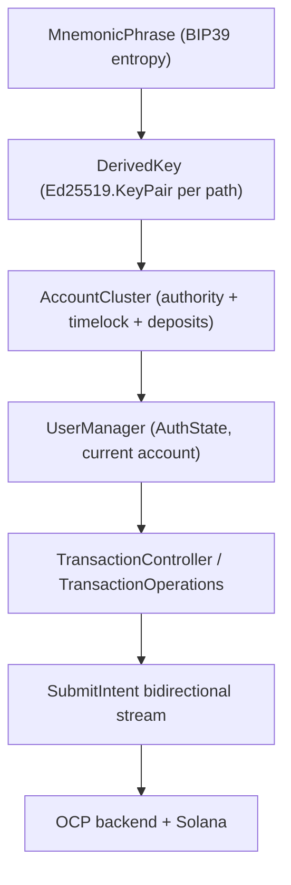
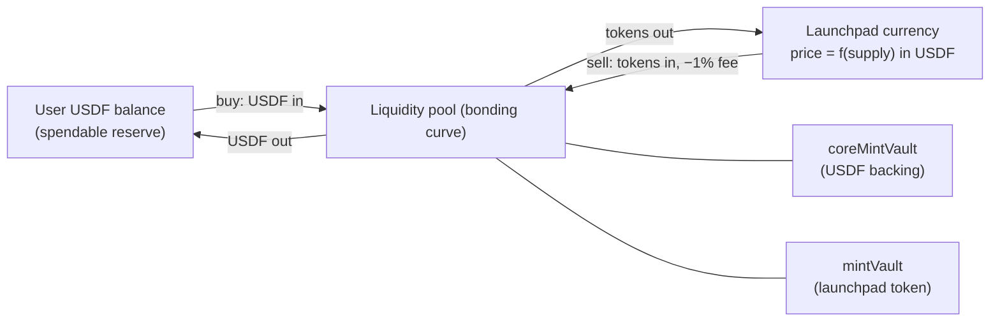

# 06 — Payments & operations

Flipcash is **self-custodial**: the device holds the keys, derives Solana accounts,
and signs every transaction locally. This document covers the currency model, key
management, the account model, the auth-state machine, and how a payment is actually
submitted.



## Currency model: USDF & launchpad currencies

Flipcash has **two kinds of currency**, and the relationship between them is the
heart of the product:

- **USDF** is the **base / reserve currency** — a USD-pegged stablecoin. In code it
  is the *"core mint"*: `Mint.usdf`
  ([`libs/encryption/keys/.../Mint.kt`](../../libs/encryption/keys/src/main/kotlin/com/getcode/solana/keys/Mint.kt)),
  modeled as a `MintMetadata` (alias `Token`) with **`launchpadMetadata = null`**.
- **Launchpad currencies** are the **user-facing, tradable tokens** — the unit people
  actually create, buy, sell, and share. Each is a custom on-chain currency **backed
  by USDF reserves**.

> **Mental model:** launchpad currencies are to USDF what memecoins are to USDC on
> Solana. USDF is the reserve everything is priced in and backed by; launchpad
> currencies are what circulates socially.

A launchpad currency is a `MintMetadata` whose `launchpadMetadata` is **non-null**
([`services/opencode/.../model/financial/MintMetadata.kt`](../../services/opencode/src/main/kotlin/com/getcode/opencode/model/financial/MintMetadata.kt)).
`LaunchpadMetadata` describes the backing and pricing:

| Field | Meaning |
|-------|---------|
| `liquidityPool` | The on-chain bonding-curve pool. |
| `mintVault` | Where the launchpad token itself is locked against the pool. |
| `coreMintVault` | **Where USDF is locked against the pool — the on-chain backing/reserves.** |
| `currentCirculatingSupplyQuarks` | Circulating supply; drives price via the curve. |
| `price`, `marketCap` | Both denominated in **USDF** (`Fiat`). |
| `sellFeeBps` | Sell fee in basis points (currently 1%). |



**Price discovery is deterministic and on-chain.** `price = f(currentSupply)` is
computed by a discrete bonding curve
([`libs/currency-math/.../curves/DiscreteBondingCurve.kt`](../../libs/currency-math/src/main/kotlin/com/flipcash/libs/currency/math/internal/curves/DiscreteBondingCurve.kt));
supply updates stream in via `LaunchpadReserveStateSnapshot` and `TokenCoordinator`,
which recomputes balances and appreciation as the price moves. (This is separate
from the **fiat** display rates in [04 — Networking](04-networking.md), which convert
USDF to the user's local currency for display.)

**Buying and selling always goes through USDF.** `SwapPurpose`
([`apps/flipcash/core/.../tokens/TokenSwapPurpose.kt`](../../apps/flipcash/core/src/main/kotlin/com/flipcash/app/core/tokens/TokenSwapPurpose.kt))
is either `Buy(mint, fundingSource)` or `Sell(mint)`, and the swap's counter-currency
is `Mint.usdf`: a buy spends USDF to mint tokens (adding USDF to the pool's
`coreMintVault`), a sell burns tokens for USDF (returning USDF, minus the 1% fee).
Creating a currency (`CurrencyCreatorViewModel`) seeds an **initial USDF buy**
(default ~$5, from a user flag) and hands the creator a cash bill of the new token.

**Sending/sharing carries any token.** A cash bill (`Bill.Cash`) holds whichever
`Token` is selected — a launchpad currency *or* USDF. Launchpad currencies render as
a custom bill (`renderAsBill = token.address != Mint.usdf`); USDF renders as plain
cash.

> **Two senses of "reserves" — don't conflate them.** (1) The on-chain USDF locked in
> a launchpad token's `coreMintVault` is the token's **backing**. (2)
> `ReservesBalanceProvider.observeReservesBalance()` →
> `balanceForToken(Mint.usdf)` is the **user's own USDF balance**, i.e. the spendable
> reserve they buy launchpad currencies with. Both are USDF, but one is pool-side
> backing and the other is the user's wallet balance.

## Keys & cryptography

The crypto primitives live under `libs/encryption/*`:

| Module | Provides |
|--------|----------|
| `libs/encryption/ed25519` | `Ed25519` — native (JNI) key generation, signing, verification; `Ed25519.KeyPair` (Parcelable). |
| `libs/encryption/mnemonic` | `MnemonicPhrase` (BIP39, 12/24 words), `DerivedKey`, `DerivePath` (Solana derivation paths). |
| `libs/encryption/keys` | Solana primitives: `PublicKey`, `Mint`, account-address derivation helpers. |
| `libs/encryption/base58`, `sha256/512`, `hmac`, `utils` | Encoding and hashing helpers. |

A user's identity starts from entropy:

```kotlin
val phrase = MnemonicPhrase.generate()                  // or fromEntropyB64(...)
val keyPair = phrase.getSolanaKeyPair(DerivePath.primary) // Ed25519.KeyPair
```

`MnemonicPhrase` caches seed derivation and exposes the entropy in Base58/Base64 —
the same Base58 entropy prefix that names the per-user database (see
[05 — Persistence](05-persistence.md)).

## The account model: `AccountCluster`

[`AccountCluster`](../../services/opencode/src/main/kotlin/com/getcode/opencode/model/accounts/AccountCluster.kt)
bundles the derived accounts that make up a wallet:

```kotlin
class AccountCluster(
    val authority: DerivedKey,                // master key controlling the account
    val timelock: TimelockDerivedAccounts,    // custody / vault accounts
) {
    val rendezvous: Ed25519.KeyPair get() = authority.keyPair   // signing key for requests
    val vaultPublicKey: PublicKey   get() = timelock.vault.publicKey
    val usdfDepositAddress: PublicKey get() = depositAddressFor(Token.usdf)

    fun depositAddressFor(token: Token): PublicKey { /* derive VM + deposit account */ }
}
```

- **authority** — the master keypair that controls the account.
- **timelock** — vault accounts in the timelock virtual machine that hold custody.
- **rendezvous** — the key used to sign requests.
- **deposit addresses** — derived per token, used for on-ramp funding.

## Auth state: `UserManager`

[`UserManager`](../../services/flipcash/src/main/kotlin/com/flipcash/services/user/UserManager.kt)
owns the mnemonic lifecycle, derives the `AccountCluster`, and exposes the current
account and a state machine as `StateFlow`s:

```kotlin
sealed interface AuthState {
    data object Unknown : AuthState
    data class Onboarding(val resumePoint: ResumePoint = ResumePoint.PostAccessKey) : AuthState
    data object Authenticating : AuthState, LoggedIn
    data object Ready : AuthState, LoggedIn        // can call authenticated APIs
    data object LoggedOut : AuthState

    val canAccessAuthenticatedApis: Boolean get() = this is Ready
}
```

`AuthState` is what the [`Router`](03-navigation.md) gates deeplinks on, and what the
`SessionController` (`:shared:session`) uses to route between onboarding, login, and
the main app.

## Submitting a payment

Payments are expressed as **intents** and submitted over the OCP `SubmitIntent`
bidirectional stream. `TransactionController` (in `:services:opencode`, implementing
`TransactionOperations`) is the public entry point; it also tracks send limits:

```kotlin
@Singleton
class TransactionController @Inject constructor(
    private val repository: TransactionRepository,
    private val swapRepository: SwapRepository,
    private val accountController: AccountController,
) : TransactionOperations {
    private val _limits = MutableStateFlow<Limits?>(Limits.Empty)
    override val limits: StateFlow<Limits?> = _limits.asStateFlow()

    override suspend fun updateLimits(owner: AccountCluster, force: Boolean) { /* ... */ }
}
```

Intent kinds include `IntentTransfer`, `IntentRemoteSend` / `IntentRemoteReceive`
(cash links), `IntentWithdraw`, `IntentStatefulSwap`, and `IntentDistribution`. The
client builds and signs the Solana transactions locally during the handshake
described in [04 — Networking](04-networking.md): send actions → receive server
parameters → sign → send signatures → success.

## Funding: `PurchaseMethodController`

[`PurchaseMethodController`](../../apps/flipcash/shared/payments/src/main/kotlin/com/flipcash/app/payments/PurchaseMethodController.kt)
coordinates how a user adds funds and exposes the selection as state:

```kotlin
interface PurchaseMethodController {
    val state: StateFlow<PurchaseMethodState>
    val selections: Flow<PurchaseMethodSelection>
    fun present(metadata: PurchaseMethodMetadata = PurchaseMethodMetadata())
    suspend fun presentDepositOptions(popToRoot: Boolean = false): AppRoute?
}
```

Methods include in-app purchase, the **Coinbase on-ramp** (REST + JWT, see
[04](04-networking.md)), and manual deposit to the cluster's deposit address.

## Why this matters

Keys never leave the device; everything from the database name to the request
signature is derived from one mnemonic. Modeling money movement as signed
**intents** over a streamed handshake — rather than fire-and-forget RPCs — is what
lets the backend verify exchange rates and limits while the client retains custody
of signing.
