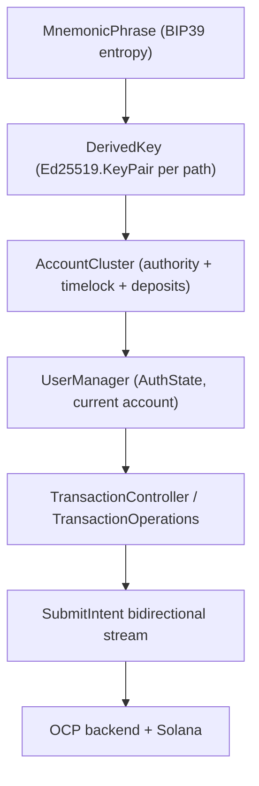

# 06 — Payments & operations

Flipcash is **self-custodial**: the device holds the keys, derives Solana accounts,
and signs every transaction locally. This document covers key management, the
account model, the auth-state machine, and how a payment is actually submitted.



## Keys & cryptography

The crypto primitives live under `libs/encryption/*`:

| Module | Provides |
|--------|----------|
| `libs/encryption/ed25519` | `Ed25519` — native (JNI) key generation, signing, verification; `Ed25519.KeyPair` (Parcelable). |
| `libs/encryption/mnemonic` | `MnemonicPhrase` (BIP39, 12/24 words), `DerivedKey`, `DerivePath` (Solana derivation paths). |
| `libs/encryption/keys` | Solana primitives: `PublicKey`, `Mint`, account-address derivation helpers. |
| `libs/encryption/base58`, `sha256/512`, `hmac`, `utils` | Encoding and hashing helpers. |

A user's identity starts from entropy:

```kotlin
val phrase = MnemonicPhrase.generate()                  // or fromEntropyB64(...)
val keyPair = phrase.getSolanaKeyPair(DerivePath.primary) // Ed25519.KeyPair
```

`MnemonicPhrase` caches seed derivation and exposes the entropy in Base58/Base64 —
the same Base58 entropy prefix that names the per-user database (see
[05 — Persistence](05-persistence.md)).

## The account model: `AccountCluster`

[`AccountCluster`](../../services/opencode/src/main/kotlin/com/getcode/opencode/model/accounts/AccountCluster.kt)
bundles the derived accounts that make up a wallet:

```kotlin
class AccountCluster(
    val authority: DerivedKey,                // master key controlling the account
    val timelock: TimelockDerivedAccounts,    // custody / vault accounts
) {
    val rendezvous: Ed25519.KeyPair get() = authority.keyPair   // signing key for requests
    val vaultPublicKey: PublicKey   get() = timelock.vault.publicKey
    val usdfDepositAddress: PublicKey get() = depositAddressFor(Token.usdf)

    fun depositAddressFor(token: Token): PublicKey { /* derive VM + deposit account */ }
}
```

- **authority** — the master keypair that controls the account.
- **timelock** — vault accounts in the timelock virtual machine that hold custody.
- **rendezvous** — the key used to sign requests.
- **deposit addresses** — derived per token, used for on-ramp funding.

## Auth state: `UserManager`

[`UserManager`](../../services/flipcash/src/main/kotlin/com/flipcash/services/user/UserManager.kt)
owns the mnemonic lifecycle, derives the `AccountCluster`, and exposes the current
account and a state machine as `StateFlow`s:

```kotlin
sealed interface AuthState {
    data object Unknown : AuthState
    data class Onboarding(val resumePoint: ResumePoint = ResumePoint.PostAccessKey) : AuthState
    data object Authenticating : AuthState, LoggedIn
    data object Ready : AuthState, LoggedIn        // can call authenticated APIs
    data object LoggedOut : AuthState

    val canAccessAuthenticatedApis: Boolean get() = this is Ready
}
```

`AuthState` is what the [`Router`](03-navigation.md) gates deeplinks on, and what the
`SessionController` (`:shared:session`) uses to route between onboarding, login, and
the main app.

## Submitting a payment

Payments are expressed as **intents** and submitted over the OCP `SubmitIntent`
bidirectional stream. `TransactionController` (in `:services:opencode`, implementing
`TransactionOperations`) is the public entry point; it also tracks send limits:

```kotlin
@Singleton
class TransactionController @Inject constructor(
    private val repository: TransactionRepository,
    private val swapRepository: SwapRepository,
    private val accountController: AccountController,
) : TransactionOperations {
    private val _limits = MutableStateFlow<Limits?>(Limits.Empty)
    override val limits: StateFlow<Limits?> = _limits.asStateFlow()

    override suspend fun updateLimits(owner: AccountCluster, force: Boolean) { /* ... */ }
}
```

Intent kinds include `IntentTransfer`, `IntentRemoteSend` / `IntentRemoteReceive`
(cash links), `IntentWithdraw`, `IntentStatefulSwap`, and `IntentDistribution`. The
client builds and signs the Solana transactions locally during the handshake
described in [04 — Networking](04-networking.md): send actions → receive server
parameters → sign → send signatures → success.

## Funding: `PurchaseMethodController`

[`PurchaseMethodController`](../../apps/flipcash/shared/payments/src/main/kotlin/com/flipcash/app/payments/PurchaseMethodController.kt)
coordinates how a user adds funds and exposes the selection as state:

```kotlin
interface PurchaseMethodController {
    val state: StateFlow<PurchaseMethodState>
    val selections: Flow<PurchaseMethodSelection>
    fun present(metadata: PurchaseMethodMetadata = PurchaseMethodMetadata())
    suspend fun presentDepositOptions(popToRoot: Boolean = false): AppRoute?
}
```

Methods include in-app purchase, the **Coinbase on-ramp** (REST + JWT, see
[04](04-networking.md)), and manual deposit to the cluster's deposit address.

## Why this matters

Keys never leave the device; everything from the database name to the request
signature is derived from one mnemonic. Modeling money movement as signed
**intents** over a streamed handshake — rather than fire-and-forget RPCs — is what
lets the backend verify exchange rates and limits while the client retains custody
of signing.
