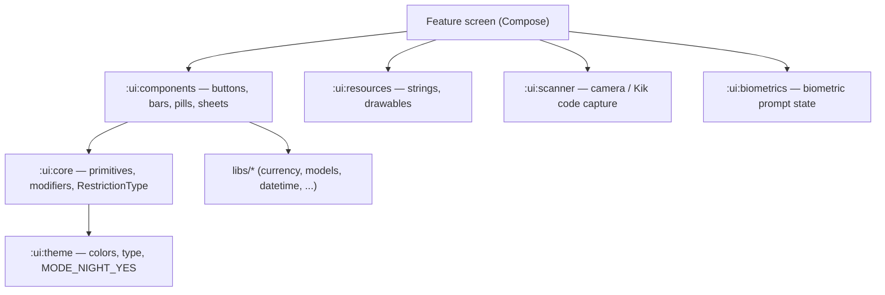

# 07 — Design system

The `ui/*` modules are the shared visual layer: theme tokens, reusable Compose
components, string/drawable resources, the camera scanner, and biometric prompts.
They depend only on `libs/*` and each other — **never on app/feature modules** — so
they can be reused everywhere without creating cycles (see
[01 — Modules & boundaries](01-modules-and-boundaries.md)).

## The modules

| Module | Role |
|--------|------|
| `:ui:theme` | Color, typography, shapes, spacing tokens. The app is **dark-mode only** (`MODE_NIGHT_YES`), so the theme targets a single palette. |
| `:ui:components` | Reusable composables — app bars, buttons, pills, bottom sheets, list rows. Depends on `libs/currency`, `libs/models`, `libs/network/exchange`, and `ui/theme`. |
| `:ui:core` | Lower-level Compose primitives, modifiers, and shared types (e.g. `RestrictionType`). Re-exported by components via `api(...)`. |
| `:ui:resources` | Strings and drawables, behind `ResourceHelper` so non-Compose code can resolve them too. |
| `:ui:navigation` | The navigation runtime used by the app: `CodeNavigator`, `BaseViewModel`, flow-route types. (See [02](02-state-and-dependency-injection.md) and [03](03-navigation.md).) |
| `:ui:scanner` | Camera preview and Kik-code capture surface used by the scanner feature. |
| `:ui:biometrics` | `rememberBiometricsState` and `LocalBiometricsState` for gating sensitive screens. |
| `:ui:emojis` | Emoji rendering/lookup helpers. |
| `:ui:testing` | Compose test utilities and `LocalUiTesting` for UI-test affordances. |

## How features consume the UI layer

Feature modules don't declare the UI layer by hand — the
`flipcash.android.feature` convention plugin injects `:ui:core`, `:ui:components`,
`:ui:navigation`, `:ui:resources`, and `:ui:theme` automatically (see
[01](01-modules-and-boundaries.md)). So a screen can use the shared components and
theme tokens immediately, and only adds an explicit dependency for the less common
pieces (`:ui:scanner`, `:ui:biometrics`, `:ui:emojis`).

## Compose conventions

- **State in, events out.** Components are stateless where possible: they take state
  plus callback lambdas and let the caller's `BaseViewModel` own the state (see
  [02](02-state-and-dependency-injection.md)).
- **Theme tokens, not literals.** Colors, type, and spacing come from `:ui:theme`
  rather than hard-coded values, so the single dark palette stays consistent.
- **Resources via `ResourceHelper`.** Strings/drawables resolve through `:ui:resources`
  / `LocalResources` so logic modules (which have no Compose) can format text too.
- **Ambient controllers via `Local*`.** Cross-cutting UI controllers (toasts,
  scrim, biometrics, navigator) are read from composition locals rather than passed
  down by hand.

## Why this matters

Keeping the design system in `ui/*` with a no-app-dependencies rule means visual
consistency is shared, not copy-pasted, and the convention-plugin baseline means
every feature starts from the same component and theme set with zero boilerplate.
