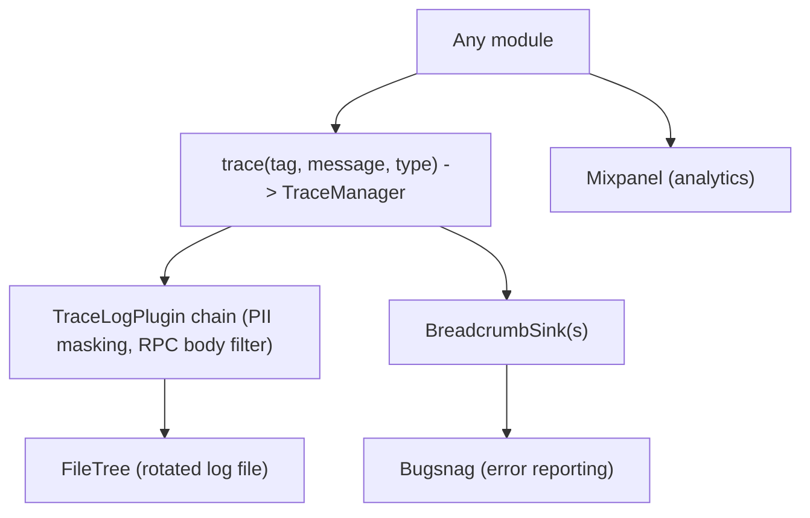

# 08 — Cross-cutting concerns

Concerns that touch every layer: logging/tracing, error reporting, analytics,
biometrics, and the async model. These are centralized so features get them
"for free" without each one reinventing instrumentation.

> **Note on async:** the app is effectively **pure Kotlin Coroutines + Flow**.
> There is no meaningful RxJava usage in app source.



## Logging & tracing

`libs/logging` centralizes tracing behind `TraceManager` and a single `trace(...)`
call:

```kotlin
trace(tag = "Transactions", message = "updating limits", type = TraceType.Process)
trace(tag = "gRPC", message = "opencode => READY", type = TraceType.StateChange)
```

- **`TraceType`** routes/labels each line: `Silent`, `Error`, `Log`, `Navigation`,
  `Process`, `Network`, `StateChange`, `User`.
- **`TraceLogPlugin`** transforms or drops lines before they're written — used for
  **PII masking** and **RPC body filtering** so secrets never hit the log file.
- **`FileTree`** writes a time-rotated local log (surfaced in the device-logs
  feature for support).
- **`BreadcrumbSink`** forwards structured breadcrumbs to external services so a
  crash report carries recent context.
- `LoggingClientInterceptor` (used by both gRPC channels, see
  [04](04-networking.md)) feeds network traces through this pipeline.

## Error reporting

`ErrorReporter` (`libs/logging`) is the abstraction over **Bugsnag**:

```kotlin
interface ErrorReporter {
    fun report(error: Throwable, cause: Throwable, isNotifiable: Boolean)
}
```

Errors implementing `NotifiableError` are flagged `isNotifiable` and routed for
elevated alerting; reports are enriched with the current `userId` (from
`TraceManager`) and recent breadcrumbs.

## Analytics

`AnalyticsService` (`libs/analytics`) defines the event surface; the Flipcash
implementation (`apps/flipcash/shared/analytics`) wraps the **Mixpanel** SDK
(`MixpanelAnalyticsDelegate`):

```kotlin
interface AnalyticsService {
    fun onAppStart()
    fun action(action: AppAction, source: AppActionSource? = null)
    // ...
}
```

It's exposed to Compose as `LocalAnalytics` and used by `UserManager` to track
auth-state transitions and user properties.

## Biometrics

`ui/biometrics` provides `rememberBiometricsState(...)` and `LocalBiometricsState`
for gating sensitive screens. It checks device support via `BiometricManager`,
prompts when required, is **lifecycle-aware** (clears the pass when the app
backgrounds), and applies a short cooldown so it doesn't re-prompt on every resume.

## Async model

- **`DispatcherProvider`** (`libs/coroutines`) abstracts `Default` / `Main` / `IO`
  dispatchers and is injected (rather than referencing `Dispatchers.*` directly) so
  code is testable.
- **Controllers** hold a `CoroutineScope(Dispatchers.IO + SupervisorJob())` and
  expose state as `StateFlow`.
- **Networking** uses `suspend` + `Result<T>` for unary calls and `Flow<T>` for
  streams.
- **Compose** drives side effects with `LaunchedEffect` / `rememberCoroutineScope`
  and collects state with `collectAsStateWithLifecycle()`.

## Build configuration

`compileSdk 36`, `minSdk 29`, **Java/Kotlin 21**, all set by the convention plugins
(see [01](01-modules-and-boundaries.md)). API keys (Bugsnag, Fingerprint, Mixpanel,
Google Cloud project number) are read from `local.properties` and surfaced through
`BuildConfig`; `google-services.json` lives under `apps/flipcash/app/src/`.

## Why this matters

One trace pipeline (with PII masking applied centrally), one error-reporting
abstraction, one analytics surface, and an injected dispatcher provider mean
instrumentation is consistent and safe by default — a feature opts in by calling
`trace(...)` or reading a `Local*`, not by wiring up its own logging.
