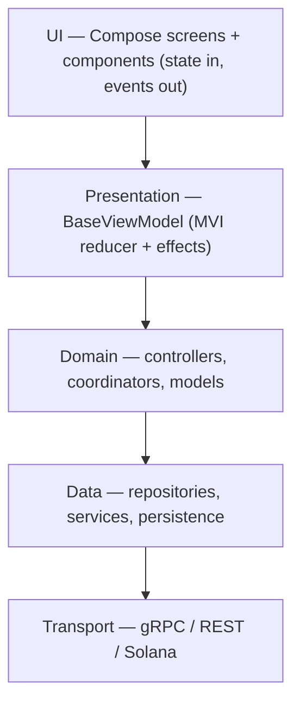

# 09 — Separation of concerns

This document ties the others together. Flipcash's architecture is, at its core,
**one rule applied consistently**: dependencies point downward through clear
layers, and each layer has a single job. The previous documents describe the
pieces; this one states the principles.

## The principles

### 1. Dependencies are acyclic and point downward
`ui/*` and `libs/*` never depend on app code; `services/*` never depend on features;
features depend on shared modules, not the other way around. The module's directory
and its convention plugin enforce this — see
[01 — Modules & boundaries](01-modules-and-boundaries.md).

### 2. UI is a function of state
Screens render from an immutable `State` and emit `Event`s; they hold no business
logic. The `BaseViewModel<State, Event>` reducer is the only place state changes,
and side effects are explicit on `eventFlow`. See
[02 — State & dependency injection](02-state-and-dependency-injection.md).

### 3. MVI for screens, controllers for shared logic
Per-screen concerns live in a feature's ViewModel. Logic shared across features
lives in a **controller/coordinator** in a `shared/*` module, exposed as a
`StateFlow`-bearing interface and delivered to Compose as a `Local*`. Features never
reach into each other's internals; they go through shared modules.

### 4. Transport details stop at the data layer
The gRPC stack's four layers (Api → Service → Repository → Controller) mean protobuf
types, channels, and signing never appear in a feature. Features consume
**controllers** that speak domain types and `Result<T>`. See
[04 — Networking](04-networking.md).

### 5. One source of truth for cached state
The database is the source of truth for lists; `RemoteMediator`s sync the network
into it and the UI observes the database. Per-user database files make account
isolation structural. See [05 — Persistence](05-persistence.md).

### 6. Cross-cutting concerns are centralized
Logging, error reporting, analytics, and biometrics are single shared
abstractions, opted into via `trace(...)` or a `Local*`, never reimplemented per
feature. See [08 — Cross-cutting concerns](08-cross-cutting-concerns.md).

### 7. Generated and signed artifacts are not hand-edited
`definitions/*:models` is generated from `.proto`; don't edit it — regenerate.
Signing and key derivation live in `libs/encryption/*` and `services/*`, not in
feature code. See [06 — Payments & operations](06-payments-and-operations.md).

## Where does this code go?

| If you're adding… | It belongs in… |
|-------------------|----------------|
| A new screen | a `:apps:flipcash:features:*` module (screen + ViewModel + Hilt module) |
| Logic two+ features share | a `:apps:flipcash:shared:*` controller/coordinator |
| A new backend call | the appropriate `:services:*` layer (Api → Service → Repository → Controller) |
| A reusable component or token | `:ui:components` / `:ui:theme` |
| A domain-agnostic utility | a `:libs:*` module |
| A new persisted entity | `:apps:flipcash:shared:persistence:db` (+ migration) |

## Why this matters

Consistency is the feature. Because every module follows the same layering, a new
engineer can predict where code lives, a change in a leaf library can't secretly
reach a screen, and each concern — rendering, state, domain logic, data, transport —
can be reasoned about and tested in isolation.
