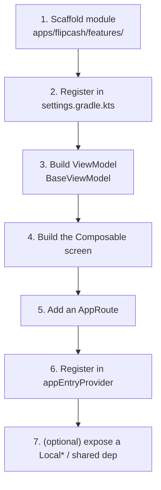

# 11 — Adding a feature

A practical, end-to-end walkthrough for the most common task: adding a new screen
as a feature module. It ties together the module system ([01](01-modules-and-boundaries.md)),
state & DI ([02](02-state-and-dependency-injection.md)), and navigation
([03](03-navigation.md)). Follow the steps in order; each links to the reference
doc for the "why."



## 1. Scaffold the module

Create `apps/flipcash/features/<name>/` with a `build.gradle.kts` applying the
feature convention plugin:

```kotlin
plugins {
    alias(libs.plugins.flipcash.android.feature)
}

dependencies {
    // Only the EXTRA deps you need — Hilt, Compose, the ui/* layer,
    // :libs:logging, and :apps:flipcash:core are injected by the plugin.
    implementation(project(":apps:flipcash:shared:session"))
    // implementation(project(":apps:flipcash:shared:tokens")) // etc.
}
```

The `flipcash.android.feature` plugin already provides Hilt, Compose, KSP,
Parcelize, `:ui:core/components/navigation/resources/theme`, `:libs:logging`, and
`:apps:flipcash:core` — don't redeclare them ([01](01-modules-and-boundaries.md)).
Use the package convention `com.flipcash.app.<name>` (see `CLAUDE.md` namespaces).

> There is a **`module-scaffolder`** agent that generates this skeleton
> (build file, package structure, entry-point files, `settings.gradle.kts`
> inclusion). Prefer it for the boilerplate, then follow the steps below to wire
> behavior.

## 2. Register the module

Add the module path to [`settings.gradle.kts`](../../settings.gradle.kts) so Gradle
includes it, then add a dependency on it from `:apps:flipcash:app`'s
`build.gradle.kts` (the app is the universal collector — [01](01-modules-and-boundaries.md)).

## 3. Build the ViewModel

Extend `BaseViewModel<State, Event>`
([`ui/navigation/.../BaseViewModel.kt`](../../ui/navigation/src/main/kotlin/com/getcode/view/BaseViewModel.kt)),
following the MVI contract from [02](02-state-and-dependency-injection.md):

```kotlin
@HiltViewModel
internal class WidgetViewModel @Inject constructor(
    private val tokenCoordinator: TokenCoordinator,   // inject domain coordinators/controllers
    dispatchers: DispatcherProvider,                  // inject dispatchers (testable)
) : BaseViewModel<WidgetViewModel.State, WidgetViewModel.Event>(
    initialState = State(),
    updateStateForEvent = updateStateForEvent,
    defaultDispatcher = dispatchers.Default,
) {
    internal data class State(val loading: Boolean = false /* ... */)

    sealed interface Event {
        data object OnAppear : Event
        data class OnLoaded(val value: String) : Event
    }

    init {
        // side effects: collect off eventFlow / external StateFlows
        eventFlow.filterIsInstance<Event.OnAppear>()
            .onEach { /* ... */ }
            .launchIn(viewModelScope)
    }

    internal companion object {
        val updateStateForEvent: (Event) -> (State.() -> State) = { event ->
            when (event) {
                is Event.OnLoaded -> { state -> state.copy(loading = false) }
                else -> { state -> state }
            }
        }
    }
}
```

- Inject **Coordinators** for cached domain state, **Controllers** for stateless
  domain APIs (see [Roles](02-state-and-dependency-injection.md#roles-coordinators-controllers-managers-services)).
- Inject `DispatcherProvider` rather than touching `Dispatchers.*` — this keeps the
  ViewModel testable ([12](12-testing.md)).
- If you need a new Hilt binding, add a `@Module @InstallIn(SingletonComponent::class)`
  in the module's `inject/` package.

## 4. Build the screen

```kotlin
@Composable
fun WidgetScreen(/* route args */) {
    val navigator = LocalCodeNavigator.current
    val session = LocalSessionController.current!!        // ambient controllers via Local*
    val viewModel = hiltViewModel<WidgetViewModel>()
    val state by viewModel.stateFlow.collectAsStateWithLifecycle()

    LaunchedEffect(viewModel) { viewModel.dispatchEvent(WidgetViewModel.Event.OnAppear) }

    // render from `state`; emit via viewModel.dispatchEvent(...)
}
```

Read long-lived controllers from `Local*`, build per-screen state from the
ViewModel, and use components/theme from the `ui/*` layer ([07](07-design-system.md)).

## 5. Add a route

Add a case to the `AppRoute` sealed hierarchy in
[`apps/flipcash/core/.../AppRoute.kt`](../../apps/flipcash/core/src/main/kotlin/com/flipcash/app/core/AppRoute.kt).
For a single screen, a `@Serializable @Parcelize data class`/`data object` is
enough. For a multi-step flow, implement `FlowRoute` (with an `initialStack`) or
`FlowRouteWithResult<T>` if it returns a value ([03](03-navigation.md)):

```kotlin
@Serializable
data class Widget(val id: String) : AppRoute
```

## 6. Register route → screen

Add one `annotatedEntry` in
[`AppScreenContent.kt`](../../apps/flipcash/app/src/main/kotlin/com/flipcash/app/internal/ui/navigation/AppScreenContent.kt):

```kotlin
annotatedEntry<AppRoute.Widget> { key -> WidgetScreen(id = key.id) }
```

Navigate to it from elsewhere with `navigator.push(AppRoute.Widget(id))`.

## 7. (Optional) expose a shared dependency

If the feature owns state or a controller that **other** features need, don't let
them depend on your feature module — put the shared piece in a
`:apps:flipcash:shared:*` module (a **Coordinator** if it owns cached/synced domain
state, a **Controller** otherwise — [Roles](02-state-and-dependency-injection.md#roles-coordinators-controllers-managers-services)),
provide it via Hilt, and if it's app-wide, surface it to Compose by adding a
`Local*` and providing it in `MainActivity`'s `CompositionLocalProvider`
([02](02-state-and-dependency-injection.md)).

## Checklist

- [ ] Module under `apps/flipcash/features/<name>` with the feature plugin
- [ ] Listed in `settings.gradle.kts` and depended on by `:apps:flipcash:app`
- [ ] `BaseViewModel<State, Event>` with an `Event` sealed interface + reducer
- [ ] Screen reads `Local*` controllers and `collectAsStateWithLifecycle()`
- [ ] `AppRoute` case added
- [ ] `annotatedEntry` registered in `appEntryProvider`
- [ ] Cross-feature logic lives in a `shared/*` module, not in the feature
- [ ] Tests for the ViewModel / any new coordinator ([12](12-testing.md))
