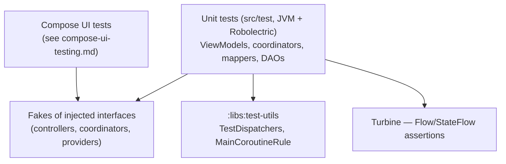

# 12 — Testing

How testing is set up across the project and what to test where. The project favors
**fast JVM unit tests** (Robolectric where Android APIs are needed) over instrumented
tests — there are ~155 unit tests and only a handful of instrumented ones. For the
Compose-UI-specific patterns, see the companion
[Compose UI Testing Guide](../compose-ui-testing.md).



## What goes where

| Test what | How | Lives in |
|-----------|-----|----------|
| **ViewModel** logic (reducer + event side effects) | Plain JUnit; inject fakes + `TestDispatchers`; assert on `stateFlow` with Turbine | the feature module's `src/test` |
| **Coordinator** sync/cache logic | Fake the wrapped Controller + persistence; drive session/lifecycle callbacks | the shared module's `src/test` |
| **DAO / Room** queries & migrations | Robolectric + in-memory Room, `runTest` | `shared/persistence/*/src/test` |
| **Mappers / pure logic** (currency, crypto, encoding) | Plain JUnit, no Android | the relevant `:libs:*` module |
| **Compose UI** | Compose test rule + fakes | see [Compose UI Testing Guide](../compose-ui-testing.md) |

## What the convention plugin gives every module

`flipcash.android.library` (and therefore every module —
[01](01-modules-and-boundaries.md)) configures unit tests automatically
([`AndroidLibraryConventionPlugin.kt`](../../build-logic/convention/src/main/kotlin/AndroidLibraryConventionPlugin.kt)):

- `testOptions { unitTests.isReturnDefaultValues = true; unitTests.isIncludeAndroidResources = true }`
- `kotlin-test-junit` on the test classpath
- A `robolectric.properties` pinning the Robolectric SDK to **36**
- `:libs:test-utils` available to tests (except for itself)

So a module can write Robolectric-backed unit tests with zero extra setup.

## Shared test utilities (`:libs:test-utils`)

Two helpers make coroutine code deterministic:

**`TestDispatchers`** — a `DispatcherProvider` whose `IO`/`Main`/`Default` all map to
a single `StandardTestDispatcher`, so injected dispatchers are controllable in tests:

```kotlin
class TestDispatchers(scheduler: TestCoroutineScheduler) : DispatcherProvider {
    val dispatcher = StandardTestDispatcher(scheduler)
    override val IO = dispatcher
    override val Main = dispatcher
    override val Default = dispatcher
}
```

**`MainCoroutineRule`** — a JUnit `TestWatcher` that `Dispatchers.setMain(...)`/
`resetMain()` around each test so `viewModelScope` uses the test dispatcher.

Because production code injects `DispatcherProvider` rather than referencing
`Dispatchers.*` ([08](08-cross-cutting-concerns.md)), passing `TestDispatchers`
makes a ViewModel or coordinator fully deterministic.

## The interface + fake pattern

The codebase is built on interfaces (controllers, coordinators, providers exposed
behind interfaces and delivered via Hilt / `Local*`). Tests substitute **hand-written
fakes** for those interfaces rather than using a mocking framework. This is the
dominant pattern — the [Compose UI Testing Guide](../compose-ui-testing.md)
documents it in detail and it applies equally to ViewModel/coordinator unit tests.

## Asserting on flows

State is exposed as `StateFlow`/`Flow`, so tests assert on emissions with
**Turbine** (`app.cash.turbine.test`) inside `runTest`:

```kotlin
@Test
fun `loads on appear`() = runTest {
    val vm = WidgetViewModel(fakeCoordinator, TestDispatchers(testScheduler))
    vm.stateFlow.test {
        assertEquals(false, awaitItem().loading)   // initial
        vm.dispatchEvent(Widget.Event.OnAppear)
        // advance/await subsequent states...
    }
}
```

## Example: a Room DAO test

DAO tests run on Robolectric against an in-memory database and use `runTest`
(e.g. `ContactDaoTest`,
`apps/flipcash/shared/persistence/db/src/test/.../dao/ContactDaoTest.kt`):

```kotlin
@RunWith(RobolectricTestRunner::class)
class ContactDaoTest {
    @Before fun setup() { /* Room.inMemoryDatabaseBuilder(...) */ }

    @Test fun `upsertSyncState and getSyncState roundtrip`() = runTest { /* ... */ }
}
```

## Running tests

```bash
./gradlew test                                   # all modules
./gradlew :apps:flipcash:features:cash:test      # one module (fast loop)
./gradlew :apps:flipcash:shared:router:test
bundle exec fastlane android flipcash_tests      # what CI runs
```

See [10 — Build & run](10-build-and-run.md) for the wider command set.

## Testing delegate event emissions

Session delegates ([02 — Delegate composition](02-state-and-dependency-injection.md#delegate-composition-sessioncontroller))
emit cross-delegate events via `Channel` (exposed as `Flow`). Tests assert on these events using
Turbine:

```kotlin
@Test
fun `emits BillReady on successful grab`() = runTest {
    val delegate = CodeScanDelegate(
        stateHolder = SessionStateHolder(),
        billController = mockk(relaxed = true),
        // ... other mocked deps, DispatcherProvider with UnconfinedTestDispatcher
    )
    // set up mock captures for onGrabbed callback ...

    delegate.events.test {
        // trigger the callback
        onGrabbedSlot.captured.invoke(token, amount, null)

        val event = awaitItem()
        assertIs<CodeScanDelegate.Event.BillReady>(event)
    }
}
```

For suspend lambda callbacks that MockK can't capture directly (a known Kotlin 2.x
compatibility issue), use the `answers { args[N] as suspend ... }` pattern instead
of `capture(slot)`.

## Guidance

- **Inject, don't reach.** A ViewModel/coordinator that takes its dependencies
  (incl. `DispatcherProvider`) as constructor params is trivially testable; one that
  reaches for singletons or `Dispatchers.*` is not.
- **Test the reducer and the effects.** Assert state transitions for events, and
  assert the side effects emitted on `eventFlow`.
- **Prefer unit + Robolectric over instrumented.** Reserve `connectedAndroidTest`
  for things that genuinely need a device.
- **Fakes over mocks.** Write a small fake implementing the interface; it's clearer
  and survives refactors better than mock setups.
