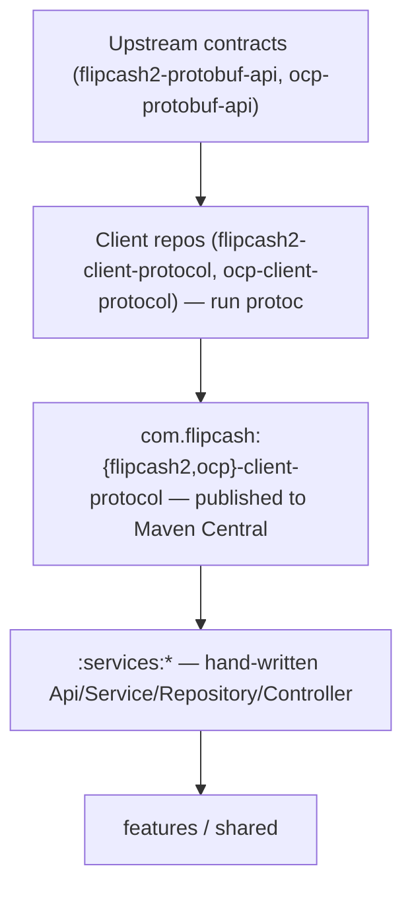

# 13 — Protobuf & code generation

The backend contract is **Protocol Buffers**, and none of it is generated in this
repo. The message classes and gRPC stubs the service layer sits on
([04 — Networking](04-networking.md)) arrive as two published artifacts.



## Where the code comes from

| Artifact | Generated from | Consumed by | Packages |
|----------|----------------|-------------|----------|
| `com.flipcash:ocp-client-protocol` | [`ocp-protobuf-api`](https://github.com/code-payments/ocp-protobuf-api) | `:services:opencode` | `com.codeinc.opencode.gen.*` |
| `com.flipcash:flipcash2-client-protocol` | [`flipcash2-protobuf-api`](https://github.com/code-payments/flipcash2-protobuf-api) | `:services:flipcash` | `com.codeinc.flipcash.gen.*` |

The artifact coordinates and the package names are deliberately different: the
coordinate is `com.flipcash` because that is the verified Maven Central namespace,
while the code inside keeps the `com.codeinc.*` packages the app has always
imported, because `java_package` in the protos sets them.

Versions are pinned in [`gradle/libs.versions.toml`](../../gradle/libs.versions.toml):

```toml
ocp-client-protocol = "0.1.0"
flipcash2-client-protocol = "0.1.0"
```

They move independently. The two contracts do not import each other, so there is
nothing to keep aligned.

Generation still targets the **lite** runtime (`protobuf-kotlin-lite`,
`grpc-protobuf-lite`) and still runs `protovalidate`, so requests validate at the
Api boundary (`...orThrow()` — see [04](04-networking.md)). That configuration now
lives in each client repo's `build.gradle.kts`; this repo supplies only the
matching runtime dependencies.

## The golden rule

> **Generated protobuf code is not in this repo, and not editable from it.** To
> change a model, change the upstream `.proto`, cut a client-protocol release, and
> bump the version here.

The hand-written code lives one layer up, in `:services:*` — the
Api/Service/Repository/Controller wrappers and the `LocalToProtobuf` /
`ProtobufToLocal` extensions that translate between protobuf and domain types.

## Updating a contract

Use the **`/fetch-protos`** skill. It finds the release that carries the change,
bumps the version in the catalog, diffs the contract between the old and new
version, and scaffolds the missing service-layer stubs.

```
/fetch-protos                      # check both artifacts for newer releases
/fetch-protos flipcash             # flipcash only
/fetch-protos opencode 0.2.0       # opencode at a specific version
```

If the contract change has not been released yet, it has to land in the client
repo first — sync the protos there at the upstream SHA, regenerate, and publish.
That repo's README covers it.

After bumping, run the **`proto-change-tracer`** agent to trace the impact through
`generated stubs → Api → Service → Repository → Controller → features` and get the
list of files that need updating.

## Typical workflow

1. `/fetch-protos <target> [version]` — bump the pin.
2. Build `:services:<target>` to confirm the new stubs resolve and compile.
3. Run `proto-change-tracer` to find affected wrappers.
4. Update the hand-written `:services:*` layer (new RPCs → new Api/Service methods;
   changed messages → mapper updates).
5. Add/adjust tests ([12 — Testing](12-testing.md)) and build.

## Why this matters

The app used to vendor its own `.proto` copies and run `protoc` in
`:definitions:*:models`, in parallel with the iOS app doing the same thing — two
copies of one contract with nothing making them agree. One generation point removes
that class of drift, and it makes a contract change a version bump with a
reviewable diff. The boundary ([01](01-modules-and-boundaries.md)) still does the
rest of the work: protobuf types stop at the service layer.
