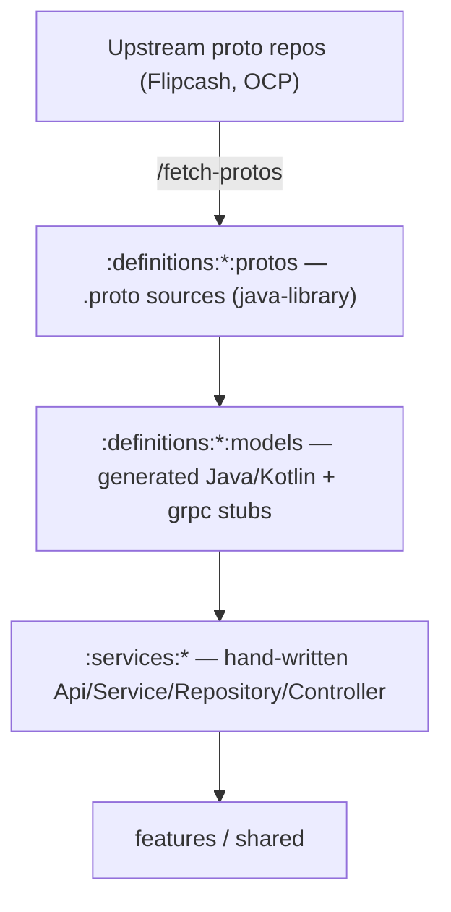

# 13 — Protobuf & code generation

The backend contract is **Protocol Buffers**. Generated gRPC/proto code is the
foundation the whole service layer sits on ([04 — Networking](04-networking.md)),
so this doc explains where it comes from, how it's generated, and how to update it
safely.



## Layout

| Module | Plugin | Contents |
|--------|--------|----------|
| `:definitions:flipcash:protos`, `:definitions:opencode:protos` | `java-library` | The raw `.proto` source files under `src/main/proto/`. The `java-library` plugin packages them so the `models` module can compile them. |
| `:definitions:flipcash:models`, `:definitions:opencode:models` | `flipcash.android.library` + `protobuf` + `protobuf.validate` | The **generated** Java/Kotlin message classes and gRPC stubs. |

The `models` build consumes the matching `protos` module via the `protobuf(...)`
configuration and runs `protoc`:

```kotlin
// definitions/<target>/models/build.gradle.kts
plugins {
    alias(libs.plugins.flipcash.android.library)
    alias(libs.plugins.protobuf)
    alias(libs.plugins.protobuf.validate)
}
dependencies {
    protobuf(project(":definitions:<target>:protos"))   // source of .proto files
    implementation(libs.grpc.protobuf.lite)
    implementation(libs.protobuf.kotlin.lite)
}
protobuf {
    protoc { artifact = "com.google.protobuf:protoc:$protobufVersion$archSuffix" }
    plugins { /* protoc-gen-grpc-java */ }
}
```

Generated output uses the **lite** runtime (`protobuf-kotlin-lite`,
`grpc-protobuf-lite`) suited to Android, and `protobuf.validate` wires up
`protovalidate` so requests can be validated at the Api boundary
(`...orThrow()` — see [04](04-networking.md)).

## The golden rule

> **Never hand-edit anything under `:definitions:*:models`.** It is generated from
> the `.proto` sources and will be overwritten. To change a model, change the
> `.proto` (upstream) and regenerate.

The hand-written code lives one layer up, in `:services:*` — the
Api/Service/Repository/Controller wrappers and the `LocalToProtobuf` /
`ProtobufToLocal` extensions that translate between protobuf and domain types.

## Updating protos

Use the **`/fetch-protos`** skill rather than copying files by hand. It fetches the
latest `.proto`s from the upstream repos, verifies they compile, summarizes the API
changes, and scaffolds missing service-layer stubs:

```
/fetch-protos                      # both targets at HEAD
/fetch-protos flipcash             # flipcash only
/fetch-protos opencode <commit>    # opencode at a specific commit
```

After fetching, run the **`proto-change-tracer`** agent to trace the impact through
`generated models → Api → Service → Repository → Controller → features` and get the
list of files that need updating.

## Typical workflow

1. `/fetch-protos <target> [commit]` — pull and regenerate.
2. Build `:definitions:<target>:models` to confirm codegen succeeds.
3. Run `proto-change-tracer` to find affected wrappers.
4. Update the hand-written `:services:*` layer (new RPCs → new Api/Service methods;
   changed messages → mapper updates).
5. Add/adjust tests ([12 — Testing](12-testing.md)) and build.

## Why this matters

Keeping generated code isolated in `:definitions:*:models` and all
human-maintained code in `:services:*` means a proto bump is a mechanical
regenerate-plus-rewire, and the boundary ([01](01-modules-and-boundaries.md)) keeps
protobuf types from leaking past the service layer.
