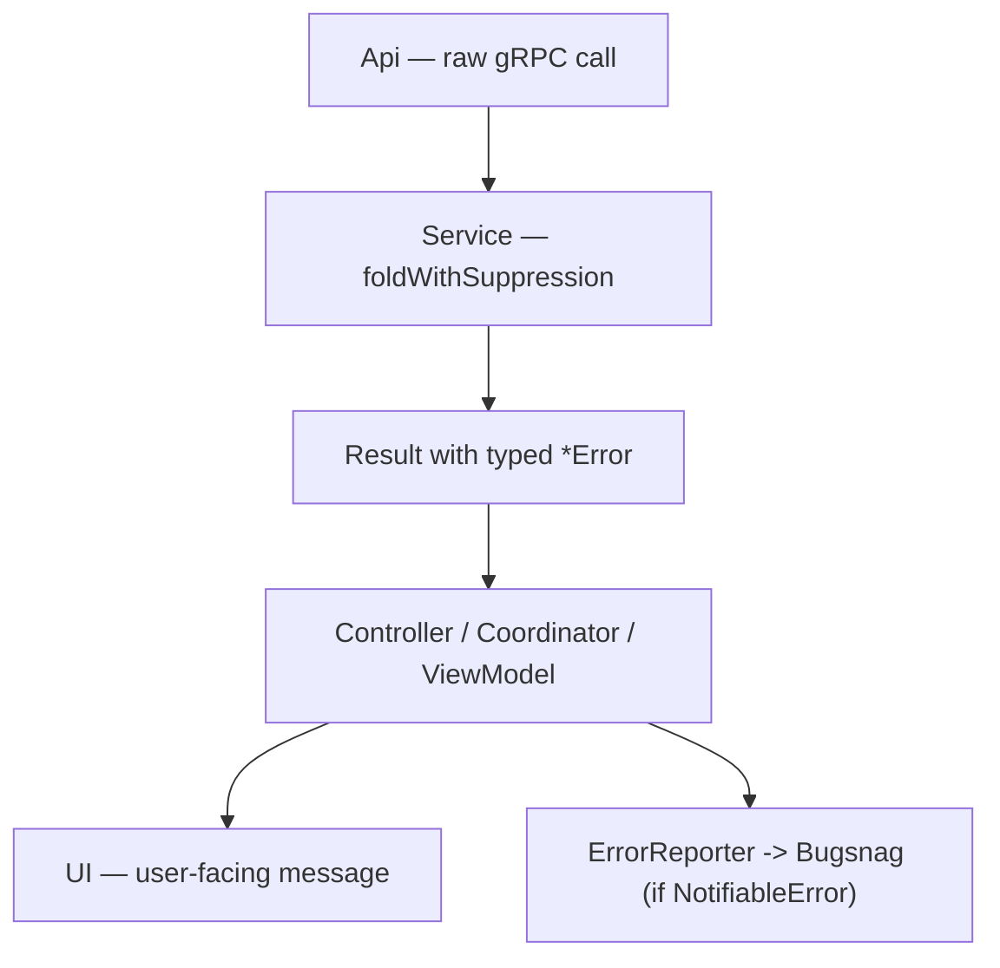

# 14 — Error handling

How failures are represented and surfaced across the app. The conventions are:
suspend functions return **`Result<T>`** with **typed domain errors**, errors that
represent genuine bugs are tagged **`NotifiableError`** so they reach Bugsnag/Slack,
and transient network calls are wrapped in **`retryable`**.



## Typed errors over raw exceptions

Backend calls map RPC status to a **sealed error hierarchy** per operation, rather
than throwing generic exceptions. The base type is `CodeServerError`
([`libs/logging/.../CodeServerError.kt`](../../libs/logging/src/main/kotlin/com/getcode/utils/CodeServerError.kt));
each RPC defines its own sealed subclass with one case per failure mode. Example
from [`services/flipcash/.../models/Errors.kt`](../../services/flipcash/src/main/kotlin/com/flipcash/services/models/Errors.kt):

```kotlin
sealed class RegisterError(message: String?, cause: Throwable? = null) : CodeServerError(message, cause) {
    class InvalidSignature : RegisterError("Invalid signature"), NotifiableError
    class Denied : RegisterError("Denied")
    class Unrecognized : RegisterError("Unrecognized"), NotifiableError
    data class Other(override val cause: Throwable? = null) :
        RegisterError(message = cause?.message, cause = cause), NotifiableError
}
```

OCP defines the same shape for its operations (e.g. `SubmitIntentError`,
`CodeAccountCheckError` in
`services/opencode/.../model/core/errors/Errors.kt`). The recurring cases are an
expected/benign set (`Denied`, `InvalidTimestamp`, …) plus a catch-all
`Other(cause)`.

## `Result<T>` at the service boundary

The **Service** layer converts a raw Api response into a `Result<T>`, mapping the
status code to the right typed error via `foldWithSuppression`
(`services/*/internal/network/extensions/`):

```kotlin
suspend fun register(owner: KeyPair): Result<ID> {
    return api.register(owner).foldWithSuppression(
        onResult = { response ->
            when (response.result) {
                OK -> Result.success(response.userId.toDomain())
                INVALID_SIGNATURE -> Result.failure(RegisterError.InvalidSignature())
                DENIED -> Result.failure(RegisterError.Denied())
                else -> Result.failure(RegisterError.Other())
            }
        },
        onError = { cause -> Result.failure(cause.toValidationOrElse { RegisterError.Other(cause = it) }) },
    )
}
```

Callers (controllers, coordinators, ViewModels) then use `onSuccess` / `onFailure`
or `fold` — they never see gRPC types ([04](04-networking.md)).

## Notifiable vs expected errors

`NotifiableError`
([`libs/logging/.../NotifiableError.kt`](../../libs/logging/src/main/kotlin/com/getcode/utils/NotifiableError.kt))
is a marker that distinguishes **bugs** from **expected outcomes**:

```kotlin
/**
 * Marker interface for errors representing unexpected failures (not user-caused).
 * Errors implementing this are tagged in Bugsnag with metadata that triggers Slack notifications.
 */
interface NotifiableError : ConditionallyNotifiable {
    override val isNotifiable: Boolean get() = true
}
```

- **Tag it `NotifiableError`** when the case "should never happen" (an invalid
  signature, an unrecognized server response) — these flow through `ErrorReporter`
  to Bugsnag and alert the team ([08 — Cross-cutting concerns](08-cross-cutting-concerns.md)).
- **Don't** tag expected, user-driven outcomes (a `Denied`, a validation failure) —
  surfacing them as noise defeats the purpose.

## Retrying transient failures

For flaky network calls, wrap the call in `retryable` / `retryableOrThrow`
([`libs/network/connectivity/public/.../Retry.kt`](../../libs/network/connectivity/public/src/main/kotlin/com/getcode/utils/network/Retry.kt))
rather than hand-rolling a loop:

```kotlin
suspend inline fun <T> retryable(
    maxRetries: Int = 3,
    delayDuration: Duration = 2.seconds,
    backoffFactor: Double = 1.0,            // 1.0 = fixed delay; >1 = exponential
    retryIf: (Throwable) -> Boolean = { true },
    // onRetry / onError default to tracing
): T?
```

`retryable` returns `null` when retries are exhausted; `retryableOrThrow` rethrows
the last exception. Use `retryIf` to retry only on transient conditions. Retries are
traced automatically ([08](08-cross-cutting-concerns.md)).

## Guidance

- **Return `Result<T>` with a typed error**, not a thrown exception, from anything
  that can fail at the service boundary.
- **One sealed error hierarchy per operation**, with an `Other(cause)` catch-all.
- **Mark genuine-bug cases `NotifiableError`**; leave expected outcomes unmarked.
- **Wrap transient calls in `retryable`** with a sensible `retryIf`.
- **Map to user-facing copy at the UI layer** — the ViewModel decides what (if
  anything) the user sees for each error case.
