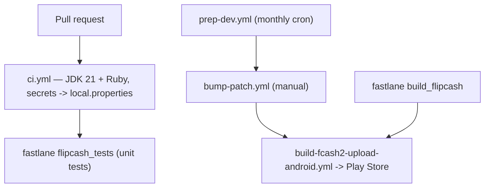

# 15 — CI & release

How the project builds, tests, versions, and ships. Day-to-day you mostly care
about the **CI** check on PRs; the rest is reference for the release pipeline and
the helper skills.

## CI (every PR)

[`.github/workflows/ci.yml`](../../.github/workflows/ci.yml) runs on `pull_request`:

1. Checks out and sets up **JDK 21 (Corretto)** and Ruby.
2. Restores the Gradle build cache.
3. Decodes `google-services.json` and writes the API-key secrets into
   `local.properties` (`BUGSNAG_API_KEY`, `GOOGLE_CLOUD_PROJECT_NUMBER`,
   `MIXPANEL_API_KEY`, `COINBASE_ONRAMP_API_KEY` — see [10 — Build & run](10-build-and-run.md)).
4. Runs `bundle exec fastlane android flipcash_tests`.

So CI == the `flipcash_tests` Fastlane lane == unit tests. Keep PRs green by running
`./gradlew test` locally first ([12 — Testing](12-testing.md)).

## Fastlane lanes

[`fastlane/Fastfile`](../../fastlane/Fastfile):

| Lane | Purpose |
|------|---------|
| `flipcash_tests` | Generates the emoji list, then runs `flipcashTestDebug` (the CI lane). |
| `build_flipcash` | Builds the release bundle (`apps:flipcash:app:bundle`) and uploads the Bugsnag/ProGuard (R8) mapping. |
| `upload_flipcash` | Uploads the build to Google Play. |
| `deploy_flipcash` | Build + deploy to Play in one step. |
| `download_from_playstore_flipcash` | Pulls store metadata. |

## Release workflows

| Workflow | Trigger | What it does |
|----------|---------|--------------|
| [`prep-dev.yml`](../../.github/workflows/prep-dev.yml) | Cron, 1st of each month (+ manual) | Increments Flipcash versioning for the new month. |
| [`bump-patch.yml`](../../.github/workflows/bump-patch.yml) | Manual (`workflow_dispatch`, choose a track) | Updates the release manifest and bumps the patch version. |
| [`build-fcash2-upload-android.yml`](../../.github/workflows/build-fcash2-upload-android.yml) | Manual | Builds and deploys Flipcash to the Play Store. |
| [`labeler.yml`](../../.github/workflows/labeler.yml) | PR opened/synchronized | Applies area labels to PRs. |

`versionCode` comes from `Packaging.Flipcash.versionCode` or `gitVersionCode()`
([10](10-build-and-run.md)).

## Helper skills

Three skills support the release/debug loop (invoke with `/<name>`):

| Skill | Use |
|-------|-----|
| `/build-lookup <versionCode>` | Find the git commit and GitHub Actions run for a given Flipcash `versionCode`. |
| `/r8-mapping <versionCode>` | Download the R8/ProGuard mapping for a release build to deobfuscate a stack trace. |
| `/release-notes <from> <to>` | Generate polished GitHub release notes from git refs. |

For where these fit among the other automation, see
[16 — Agents & skills](16-agents-and-skills.md).

## Why this matters

CI is intentionally narrow (unit tests via one Fastlane lane), so a fast local
`./gradlew test` is a faithful preview. Versioning is automated (monthly prep +
patch bumps) and releases go through Fastlane, so manual version edits are rarely
needed — reach for the skills above when investigating a shipped build.
