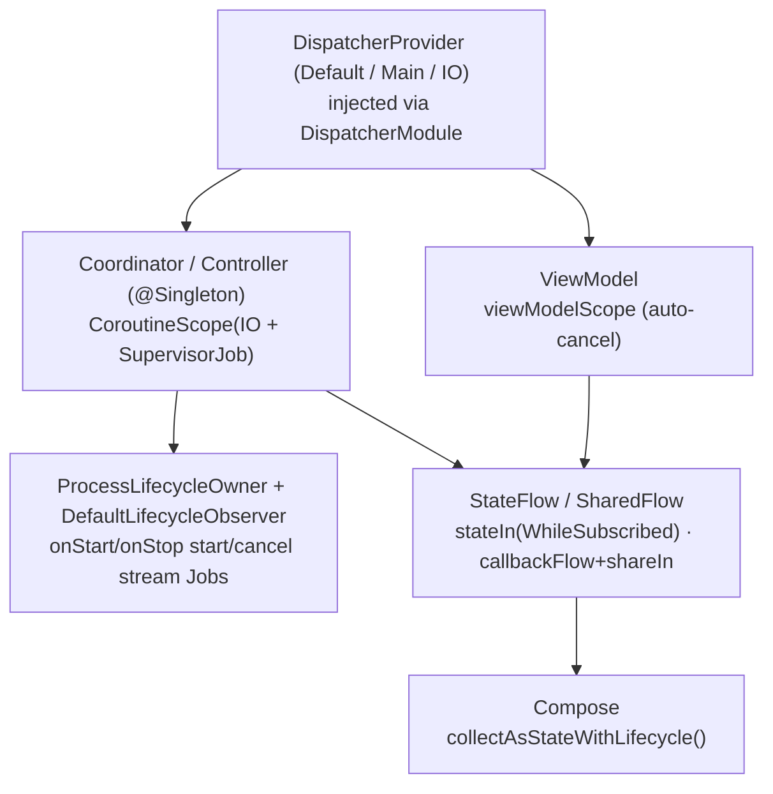

# 17 — Concurrency

Flipcash is **Coroutines + Flow** end to end (no RxJava). This doc covers the
conventions that keep that manageable: who owns a `CoroutineScope`, when to inject
a dispatcher vs. use `viewModelScope`, how state is exposed as `Flow`, and how
collection stays lifecycle-aware.



## Dispatchers are injected, not referenced

Code does not call `Dispatchers.IO`/`Default`/`Main` directly; it depends on
`DispatcherProvider`
([`libs/coroutines/.../DispatcherProvider.kt`](../../libs/coroutines/src/main/kotlin/com/flipcash/libs/coroutines/DispatcherProvider.kt)):

```kotlin
interface DispatcherProvider {
    val Default: CoroutineDispatcher
    val Main: CoroutineDispatcher
    val IO: CoroutineDispatcher
}
```

The production binding is `DefaultDispatcherProvider` (just delegates to
`Dispatchers.*`), provided `@Singleton` by `DispatcherModule`
([`apps/flipcash/app/.../inject/DispatcherModule.kt`](../../apps/flipcash/app/src/main/kotlin/com/flipcash/app/inject/DispatcherModule.kt)).
Injecting it is what makes coroutine code deterministic in tests — swap in
`TestDispatchers` ([12 — Testing](12-testing.md)).

- **CPU-bound work** → `dispatchers.Default` (also the default for `BaseViewModel`
  event dispatch, [02](02-state-and-dependency-injection.md)).
- **Network / disk / DataStore / Room** → `dispatchers.IO`.
- **UI-touching work** → `dispatchers.Main` (rarely needed explicitly; Compose
  collection is already on the main thread).

## Scope ownership

Every coroutine belongs to a scope owned by exactly one thing:

| Owner | Scope | Cancellation |
|-------|-------|--------------|
| **ViewModel** | `viewModelScope` | Automatic on `onCleared()`. |
| **Coordinator / Controller** (`@Singleton`) | `CoroutineScope(Dispatchers.IO + SupervisorJob())` | Lives for the process; child failures are isolated by `SupervisorJob`. |
| **Composable** | `rememberCoroutineScope()` / `LaunchedEffect` | Tied to composition. |

ViewModels never create their own scope — they use `viewModelScope` so work dies
with the screen. Long-lived singletons (e.g. `TransactionController`,
`TokenCoordinator`, `ChatCoordinator`, `UserFlagsCoordinator`) own one
`IO + SupervisorJob` scope and launch their flows into it.

### App-lifecycle awareness

There is **no custom `@ApplicationScope`**. Instead, singletons that stream from the
backend implement `DefaultLifecycleObserver` and register with the process lifecycle,
starting/cancelling streaming `Job`s as the app foregrounds/backgrounds:

```kotlin
@Singleton
class TokenCoordinator @Inject constructor(/* ... */) :
    SessionListener, DefaultLifecycleObserver, /* ... */ {

    private val scope = CoroutineScope(Dispatchers.IO + SupervisorJob())
    private var streamReserveStateJob: Job? = null

    init { ProcessLifecycleOwner.get().lifecycle.addObserver(this) }

    override fun onStart(owner: LifecycleOwner) { streamReserveStates() }   // foreground
    override fun onStop(owner: LifecycleOwner)  { streamReserveStateJob?.cancel() } // background
}
```

This keeps background work off when the app isn't visible, and resumes (re-syncing)
on return. Session transitions (login/logout) are handled the same way via
`SessionListener` — see the coordinator role in
[02](02-state-and-dependency-injection.md#roles-coordinators-controllers-managers-services).

## Flow conventions

State is exposed as **read-only `Flow`**, mutated only internally:

- Hold internal state in `MutableStateFlow` / `MutableSharedFlow`; expose it as
  `StateFlow` / `SharedFlow` via `asStateFlow()` / `asSharedFlow()` (the
  `BaseViewModel` pattern, [02](02-state-and-dependency-injection.md)).
- Derive hot state with
  `stateIn(scope, SharingStarted.WhileSubscribed(5_000), default)` — shares one
  upstream across collectors and stops it shortly after the last unsubscribes.
  `SharingStarted.Eagerly` is used for always-on state (e.g. feature-flag overrides).
- Bridge callback APIs with `callbackFlow { … awaitClose { unregister } }`, then
  `debounce` / `distinctUntilChanged` / `shareIn`. The connectivity observer
  ([`Api24NetworkObserver`](../../libs/network/connectivity/impl/src/main/kotlin/com/getcode/utils/network/Api24NetworkObserver.kt))
  is the canonical example.
- Combine and switch with `combine`, `flatMapLatest`, `mapNotNull`,
  `filterIsInstance`; attach side effects with `…onEach { }.launchIn(scope)`.

## Lifecycle-aware collection

UI collects with **`collectAsStateWithLifecycle()`** so collection pauses below
`STARTED` and resumes without re-subscribing churn:

```kotlin
val state by viewModel.stateFlow.collectAsStateWithLifecycle()
```

For non-state work that must run only while a lifecycle is at a given state, use the
`RepeatOnLifecycle` helper
([`ui/navigation/.../utils/lifecycle/RepeatOnLifecycle.kt`](../../ui/navigation/src/main/kotlin/com/getcode/navigation/utils/lifecycle/RepeatOnLifecycle.kt)),
which wraps `repeatOnLifecycle`. One-shot effects (navigation, showing a bill) are
collected off `eventFlow` inside a `LaunchedEffect` ([02](02-state-and-dependency-injection.md)).

## Testing

Because dispatchers are injected, tests pass `TestDispatchers` (all of
`IO`/`Main`/`Default` mapped to one `StandardTestDispatcher`) and use
`MainCoroutineRule` to drive `viewModelScope`. Assert on flows with Turbine inside
`runTest`. See [12 — Testing](12-testing.md).

## Guidance

- **Own your scope.** ViewModel → `viewModelScope`; singleton → one
  `IO + SupervisorJob` scope; never leak a `GlobalScope`.
- **Inject `DispatcherProvider`** instead of touching `Dispatchers.*` — it's the
  testability seam.
- **Expose `StateFlow`/`SharedFlow`, never the mutable type.**
- **Gate streaming on lifecycle** (`ProcessLifecycleOwner` + `onStart`/`onStop`) so
  background work stops.
- **Collect with `collectAsStateWithLifecycle()`** in Compose.
