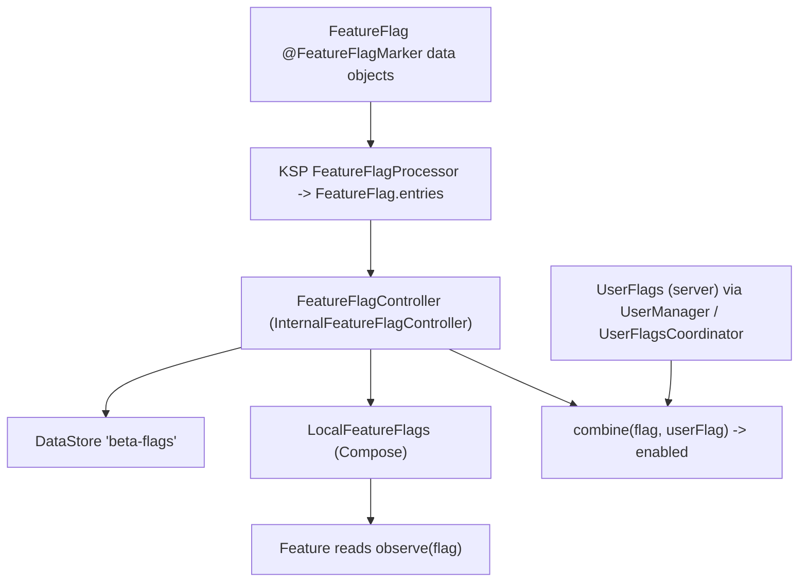

# 18 — Feature flags

Flipcash has **two** independent toggle systems, and conflating them is the most
common mistake:

- **Feature flags** — *client-side* toggles for rolling out / experimenting with app
  features. Defined in code, stored locally, flipped by developers/staff.
- **User flags** — *server-driven, per-account* configuration and entitlements
  (e.g. `isStaff`). Delivered with the account, optionally overridden locally.

This doc covers feature flags first, then the distinction.



## What a feature flag is

A feature flag is a typed toggle behind the `FeatureFlagController` interface
([`apps/flipcash/shared/featureflags/.../FeatureFlagController.kt`](../../apps/flipcash/shared/featureflags/src/main/kotlin/com/flipcash/app/featureflags/FeatureFlagController.kt)):

```kotlin
interface FeatureFlagController {
    fun observe(): StateFlow<List<BetaFeature>>
    fun observe(flag: FeatureFlag<*>): StateFlow<Boolean>
    suspend fun get(flag: FeatureFlag<*>): Boolean
    fun set(flag: FeatureFlag<*>, value: Boolean)
    fun setOption(flag: FeatureFlag<*>, optionKey: String)
    fun getOption(flag: FeatureFlag<*>): StateFlow<String>
    fun observeOverride(): StateFlow<Boolean>            // global beta unlock
    fun enableBetaFeatures(); fun disableBetaFeatures()
    fun reset(flag: FeatureFlag<*>); fun reset()
}
```

The implementation `InternalFeatureFlagController` persists values in a DataStore
(`beta-flags`). It's provided `@Singleton` by `FeatureFlagModule` and surfaced to
Compose as `LocalFeatureFlags` (provided in `MainActivity`,
[02](02-state-and-dependency-injection.md)); outside a provider the default is the
inert `NoOpFeatureFlagController`.

## Defining / adding a flag

Flags are `@FeatureFlagMarker data object`s implementing `FeatureFlag<T>`
([`FeatureFlag.kt`](../../apps/flipcash/shared/featureflags/src/main/kotlin/com/flipcash/app/featureflags/FeatureFlag.kt)):

```kotlin
@FeatureFlagMarker
data object CredentialManager : FeatureFlag<Boolean> {
    override val key = "credential_manager_enabled"  // DataStore key
    override val default = false
    override val launched = false       // true => fully shipped, no longer toggleable
    override val visible = true         // shows in debug menus
    override val persistLogOut = true   // survives logout
}
```

Boolean flags are the norm (`VibrateOnScan`, `BillCustomizer`, `CurrencyCreator`,
`Messenger`, …); option flags carry a list of choices (e.g. `BackgroundReset`). A
**KSP processor** (`FeatureFlagProcessor`, `apps/flipcash/shared/ksp/`) discovers
every `@FeatureFlagMarker` and generates the `FeatureFlag.entries` registry the
debug UI iterates.

**To add a flag:** declare a new `@FeatureFlagMarker data object` in `FeatureFlag.kt`
with a unique `key` and `default` (plus title/description text alongside the other
flags). KSP regenerates `entries`; no manual registration. Read it where needed.

## Reading / observing a flag

```kotlin
// In a coordinator/controller (inject FeatureFlagController):
featureFlags.observe(FeatureFlag.BillTextures)
    .onEach { enabled -> _state.update { it.copy(enabled = enabled) } }
    .launchIn(scope)

// In Compose:
val flags = LocalFeatureFlags.current
```

Prefer `observe(flag)` (reactive `StateFlow`) so the UI updates when a flag flips;
use `get(flag)` for a one-shot read.

## Beta override & staff gating

Flags that aren't `launched` are hidden unless **beta features** are unlocked, via
either `observeOverride()` (a debug-menu toggle) or staff status from the user's
account flags. Features combine the two:

```kotlin
combine(
    featureFlagController.observeOverride(),
    userManager.state.map { it.flags?.isStaff == true },
) { override, isStaff -> override || isStaff }
    .onEach { dispatchEvent(Event.OnBetaFeaturesUnlocked(it)) }
    .launchIn(viewModelScope)
```

(See `MyAccountScreenViewModel` and `LabsScreenViewModel`.)

## Feature flags vs user flags

| | Feature flags | User flags |
|---|---------------|-----------|
| **Module** | `:apps:flipcash:shared:featureflags` | `:apps:flipcash:shared:userflags` |
| **Owner** | `FeatureFlagController` | `UserFlagsCoordinator` |
| **Source** | Client; defined in `FeatureFlag.kt` | **Server**, per account (`UserFlags`) |
| **Storage** | Local DataStore (`beta-flags`) | Account state + local override DataStore |
| **Purpose** | Feature rollout / experiments | Entitlements & account config (`isStaff`, `enablePhoneNumberSend`, `preferredOnRampProvider`) |
| **Read via** | `observe(flag)` / `LocalFeatureFlags` | `userManager.state.flags` / `UserFlagsCoordinator.resolvedFlags` |

`UserFlags` lives in
[`services/flipcash/.../models/UserFlags.kt`](../../services/flipcash/src/main/kotlin/com/flipcash/services/models/UserFlags.kt);
`UserFlagsCoordinator` resolves each as a `ResolvedFlag` whose `effectiveValue` is the
server value unless a local override is set (staff/debug). A feature often gates on
**either** signal — e.g. `ChatCoordinator` enables messaging when
`FeatureFlag.PhoneNumberSend` **or** the server's `enablePhoneNumberSend` is on:

```kotlin
combine(
    featureFlags.observe(FeatureFlag.PhoneNumberSend),
    userManager.state.map { it.flags?.enablePhoneNumberSend == true },
) { feature, server -> feature || server }
```

## Guidance

- **Pick the right system:** a client rollout toggle → feature flag; an
  account-level entitlement from the backend → user flag.
- **Add flags in `FeatureFlag.kt`** and let KSP register them; don't maintain a
  manual list.
- **Observe, don't poll** — `observe(flag)` so UI reacts to changes.
- **Mark a flag `launched`** once it ships to retire the toggle.
