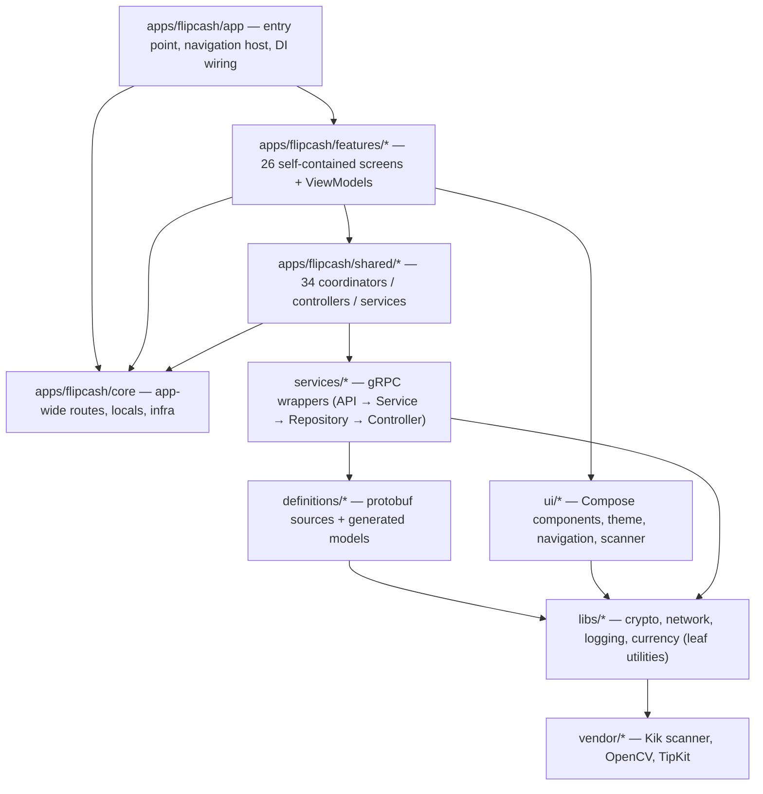

# Flipcash Android — Architecture

A guide to how the Android app is structured. Each document covers one
architectural concern; start here, then jump to the topic you need.

> **These docs describe structure and intent, not every line of code.** If the
> documentation and the code disagree, **the code is authoritative** — fix the
> docs. When you change a subsystem, update its document in the same commit.

## What Flipcash is

Flipcash is a **self-custodial mobile wallet** for instant, global, private
payments. Its base reserve currency is **USDF** (a USD stablecoin); on top of it,
users create, buy, sell, and share **launchpad currencies** — custom on-chain tokens
**backed by USDF reserves** (think memecoins backed by USDC on Solana). Launchpad
currencies are the unit that circulates socially; USDF is what they're priced in and
redeemable for. The signature interaction is a **device-to-device cash bill** (which
can carry a launchpad currency or USDF): one phone renders a cash bill displaying an
animated circular **Kik Code** on screen, another phone scans the code, and a
peer-to-peer handshake settles the payment. The app also supports contact/username sends, on-ramp funding (Coinbase,
in-app purchase), buying/selling launchpad currencies against USDF, and on-chain
withdrawals.

Under the hood it talks to **two gRPC backends** — the Flipcash service
(accounts, profiles, chat, activity) and the Open Code Protocol / OCP service
(transactions, intents, exchange rates) — and signs operations on **Solana** with
**Ed25519** keys derived from a BIP39 mnemonic. State is cached locally in **Room**,
the UI is **Jetpack Compose** (dark-mode only), and dependencies are wired with
**Hilt** + **CompositionLocal**.

## The layer cake

*Arrows point to dependencies; the graph is acyclic. `ui/*` and `libs/*` never
depend on app modules.* See [01 — Modules & boundaries](01-modules-and-boundaries.md).

## Documentation index

| # | Topic | Scope |
|---|-------|-------|
| 01 | [Modules & boundaries](01-modules-and-boundaries.md) | ~132 modules, convention plugins, dependency graph, `public`/`impl`/`bindings` pattern, enforced boundaries |
| 02 | [State & dependency injection](02-state-and-dependency-injection.md) | Hilt setup, the CompositionLocal injection pattern, `BaseViewModel<State,Event>` MVI |
| 03 | [Navigation](03-navigation.md) | Navigation3, the `AppRoute` sealed graph, `CodeNavigator`, `Router` deeplink dispatch with auth gating |
| 04 | [Networking](04-networking.md) | gRPC layering, managed channels, Ed25519 signing, `SubmitIntent` streaming, REST/JWT/Coinbase, exchange rates, connectivity |
| 05 | [Persistence](05-persistence.md) | Room, per-user database naming, DAOs, Paging `RemoteMediator`s, DataStore |
| 06 | [Payments & operations](06-payments-and-operations.md) | Key management, `AccountCluster`, `AuthState`, intent submission handshake, purchase methods |
| 07 | [Design system](07-design-system.md) | The `ui/*` layer, theme, components, scanner, biometrics, Compose conventions |
| 08 | [Cross-cutting concerns](08-cross-cutting-concerns.md) | Logging/tracing, error reporting, analytics, biometrics, coroutines, build config |
| 09 | [Separation of concerns](09-separation-of-concerns.md) | Layering principles, MVI/MVVM split, where logic lives, the acyclic discipline |
| — | [Feature catalog](features/README.md) | Representative features by category, with screens, ViewModels, and patterns |

### Guides (how to work in the codebase)

| # | Topic | Scope |
|---|-------|-------|
| 10 | [Build & run](10-build-and-run.md) | Prerequisites, the real `local.properties` keys, Gradle commands, variants, CI |
| 11 | [Adding a feature](11-adding-a-feature.md) | End-to-end: scaffold module → ViewModel → screen → route → register → share |
| 12 | [Testing](12-testing.md) | What to test where, `:libs:test-utils`, Robolectric, fakes, Turbine (+ Compose UI guide) |
| 13 | [Protobuf & codegen](13-protobuf-and-codegen.md) | proto sources → generated models → services; updating protos with `/fetch-protos` |
| 14 | [Error handling](14-error-handling.md) | `Result<T>`, typed sealed errors, `NotifiableError`, `retryable` |
| 15 | [CI & release](15-ci-and-release.md) | The CI check, Fastlane lanes, release workflows, helper skills |
| 16 | [Agents & skills](16-agents-and-skills.md) | The repo's Claude Code agents/skills and which task each one fits |
| 17 | [Concurrency](17-concurrency.md) | Dispatchers, scope ownership, Flow conventions, lifecycle-aware collection |
| 18 | [Feature flags](18-feature-flags.md) | Defining/observing flags, beta & staff gating, feature flags vs user flags |
| — | [Glossary](glossary.md) | Domain & architecture terms (USDF, intent, timelock, coordinator, …) |

## Suggested reading paths

- **New to the codebase** → 10 (build & run) → README → 01 → 02 → 09, then the feature catalog.
- **Building a feature** → 11 (adding a feature) → feature catalog → 03 → 07 → 02 → 18 (feature flags).
- **Writing async code** → 17 (concurrency) → 02 → 12 (testing).
- **Writing tests** → 12 (testing) → [Compose UI Testing Guide](../compose-ui-testing.md).
- **Working on payments** → 06 → 04 → 05 → 14 (error handling).
- **Backend / proto changes** → 13 (protobuf & codegen) → 04 → 05 → 14.
- **New to Claude Code automation here** → 16 (agents & skills) → CLAUDE.md.

Unfamiliar with a term? The [Glossary](glossary.md) defines the domain and
architecture vocabulary (USDF, intent, timelock, coordinator, …).
