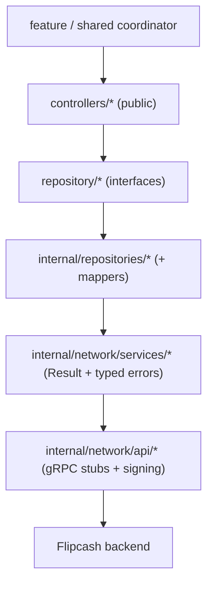

# services/flipcash

The Android client for the **Flipcash app backend** — accounts/auth, profiles,
contacts, chat & messaging, activity feed, moderation, push, settings, and
third-party (on-ramp) integration. It builds on [`services/opencode`](../opencode/README.md)
(re-exported via `api(...)`) for the core gRPC infrastructure and Solana models.

> Namespace `com.flipcash.services.*`. Layering (API → Service → Repository →
> Controller) is described in
> [04 — Networking](../../docs/architecture/04-networking.md); the auth state machine
> and account model in [06 — Payments & operations](../../docs/architecture/06-payments-and-operations.md).

## Public API — controllers

Fourteen controllers, each backed by a `repository/` interface (implemented by an
`internal/repositories/InternalXxxRepository`):

| Controller | Area |
|------------|------|
| [`AccountController`](src/main/kotlin/com/flipcash/services/controllers/AccountController.kt) | Register, login, get user flags |
| `ProfileController` | Display name, profile, social-account linking |
| `ContactListController` | Contact CRUD; checksum / delta / full upload |
| `ContactVerificationController` | Email & phone verification |
| `ResolverController` | Contact resolution |
| `ChatController` / `ChatMessagingController` | Chat retrieval; send/receive, typing, pointers |
| `EventStreamingController` | **Streaming** chat updates (`Flow<ChatUpdate>`) |
| `ActivityFeedController` | Activity feed |
| `ModerationController` | Text / image moderation |
| `PushController` | Push-token registration |
| `PurchaseController` | In-app-purchase acknowledgement |
| `SettingsController` | Locale / region settings |
| `ThirdPartyController` | On-ramp providers, liquidity pools |

## Models, auth & state

- **`models/`** — public domain types: `UserFlags` (server-driven account flags &
  entitlements, e.g. `isStaff`, `enablePhoneNumberSend`), `UserProfile`,
  the `chat/` models (`ChatMetadata`, `ChatMessage`, `ChatUpdate`, …), `Jwt`,
  `QueryOptions`/`PagingToken`, and `Errors.kt` — **50+ sealed error hierarchies**
  (`LoginError`, `RegisterError`, `SendMessageError`, …) over `CodeServerError`
  ([14 — Error handling](../../docs/architecture/14-error-handling.md)).
- **`user/UserManager`** — the singleton auth **state machine** (`AuthState`:
  `Unknown → Onboarding → Authenticating → Ready → LoggedOut`), exposing
  `state: StateFlow`, the `mnemonic`/`entropy`, `accountCluster`, `userFlags`,
  `profile`. It's the source of truth for "am I logged in?" across the app
  ([06](../../docs/architecture/06-payments-and-operations.md)).
- `modals/ModalManager`, `persistence/` (`DataSource` abstractions), `validators/`.

## DI & channels

`inject/FlipcashModule` (`internal`) provides two channels into `SingletonComponent`:

- `@FlipcashManagedChannel` — unary (`idleTimeout 5m`, `keepAliveWithoutCalls=false`).
- `@FlipcashManagedStreamingChannel` — streaming (`keepAliveWithoutCalls=true`).

Both target the Flipcash base URL with the `LoggingClientInterceptor`, configured via
`@FlipcashProtocol ProtocolConfig`. It also **binds** the 14 repository interfaces to
their `Internal*` implementations. The module's `build.gradle.kts` `api(...)`-exports
`:services:opencode` and `:libs:network:jwt`.

## Deep dive: signing & the request lifecycle

Requests are signed with the owner's **Ed25519** key at the API boundary.
`internal/network/extensions/` holds the helpers: `sign(owner)` /
`authenticate(owner)` (build `Common.Signature` / `Common.Auth`) plus
`LocalToProtobuf` / `ProtobufToLocal` converters between domain and generated types.
A typical call — e.g. `AccountController.register` → `AccountService.register` →
`AccountApi.register` — builds the protobuf request, validates it (`protovalidate`),
signs it, sends it on the unary channel, and folds the response into a
`Result<ID>` with a typed error on failure (`RegisterError.*`).

## Deep dive: event streaming

`EventStreamingController` exposes chat updates as a `Flow<ChatUpdate>` over the
streaming channel. The stream is opened/closed explicitly and its **lifecycle is the
caller's responsibility** (a coordinator owns the scope and re-opens on
foreground/reconnect).

## Adding an RPC

1. **Proto** — update `definitions/flipcash`, regenerate
   ([13](../../docs/architecture/13-protobuf-and-codegen.md)).
2. **Api** — add the call to `internal/network/api/XxxApi` (build request, sign, validate).
3. **Service** — map the response to `Result<T>` + a typed error in
   `internal/network/services/XxxService`.
4. **Repository** — add to the `repository/` interface and `internal/repositories/InternalXxxRepository`
   (+ a mapper if the model needs translating).
5. **Controller** — expose it on the public `controllers/XxxController`; bind any new
   repository in `FlipcashModule`.

## See also

- [04 — Networking](../../docs/architecture/04-networking.md) · [06 — Payments & operations](../../docs/architecture/06-payments-and-operations.md) · [13 — Protobuf & codegen](../../docs/architecture/13-protobuf-and-codegen.md) · [14 — Error handling](../../docs/architecture/14-error-handling.md)
- Core infra & models: [`services/opencode`](../opencode/README.md) · Compose bindings: [`services/flipcash-compose`](../flipcash-compose/README.md)
