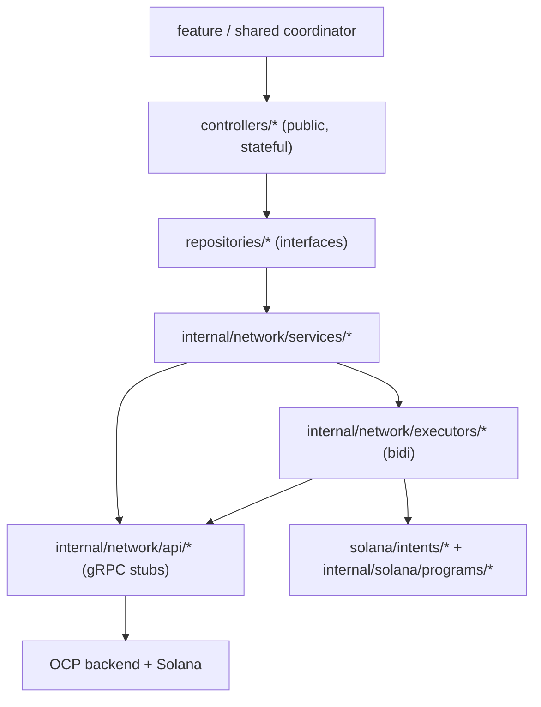
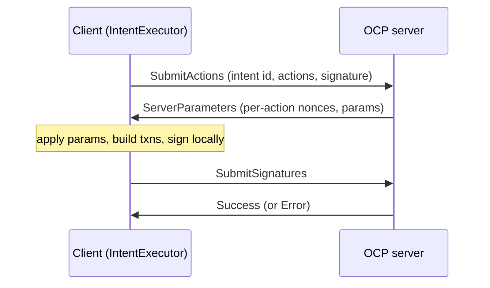

# services/opencode

The Android client for the **Open Code Protocol (OCP)** — the gRPC backend that
handles money movement: transactions/intents, swaps, exchange rates, accounts, and
the Solana transaction construction that backs them. This is the deeper of the two
service modules; `services/flipcash` wraps the Flipcash app backend and depends on
this one.

> Namespace `com.getcode.opencode.*`. For the layering this module follows
> (API → Service → Repository → Controller) see
> [04 — Networking](../../docs/architecture/04-networking.md); for the currency model
> (USDF, launchpad tokens, `AccountCluster`) see
> [06 — Payments & operations](../../docs/architecture/06-payments-and-operations.md).

## Public API — controllers

Features consume **controllers** (and the `Exchange` interface); everything under
`internal/` is off-limits.

| Controller | Purpose | Key surface |
|------------|---------|-------------|
| [`TransactionController`](src/main/kotlin/com/getcode/opencode/controllers/TransactionController.kt) | Submits intents (transfer, withdraw, remote send/receive, buy/sell), tracks limits | `submitIntent(...)`, `buy/sell/withdraw`, `limits: StateFlow`, implements [`TransactionOperations`](src/main/kotlin/com/getcode/opencode/controllers/TransactionOperations.kt) |
| [`AccountController`](src/main/kotlin/com/getcode/opencode/controllers/AccountController.kt) | Account clusters, linking/unlinking, account-state polling | active-cluster + account-list `StateFlow`s |
| [`TokenController`](src/main/kotlin/com/getcode/opencode/controllers/TokenController.kt) | **Stateless** network gateway for token metadata / balances | flows only; caching is the consumer's job (the `TokenCoordinator`) |
| [`CurrencyController`](src/main/kotlin/com/getcode/opencode/controllers/CurrencyController.kt) | Rates, currencies, live/historical mint data | `streamLiveMintData()`, rate flows |
| [`MessagingController`](src/main/kotlin/com/getcode/opencode/controllers/MessagingController.kt) | P2P bill messaging streams (give/grab/claim) | open/poll/ack message stream |

Repositories (`repositories/`) are the interface seam beneath the controllers:
`Transaction`, `Account`, `Currency`, `Messaging`, `Swap`, `Event` — each implemented
by an `Internal*Repository` under `internal/domain/repositories`.

## Models

Public domain models live under `model/` (see
[06](../../docs/architecture/06-payments-and-operations.md) for the economic model):

- **`model/financial/`** — `MintMetadata` (alias `Token`; `Token.usdf`),
  `LaunchpadMetadata` (USDF-backed bonding-curve fields), `Fiat`/`LocalFiat`/
  `VerifiedFiat`, `Rate`, `Currency`/`CurrencyCode`, `Fee`, `Limits`, `Distribution`.
- **`model/accounts/`** — `AccountCluster` (authority + timelock + per-token deposit
  addresses), `TimelockDerivedAccounts`, `AccountType`, `GiftCardAccount`, `PoolAccount`.
- **`model/transactions/`** — `TransactionMetadata`, `SwapMetadata`/`SwapState`,
  `ExchangeData` (`Verified`/`Unverified`).
- **`model/core/`** — `OpenCodePayload` (the QR/rendezvous payload), `ID`.

## DI & channels

`inject/` provides three Hilt modules into `SingletonComponent`:

- **`OpenCodeModule`** — `Exchange`, `ProtocolConfig` (`@OpenCodeProtocol`), and the
  two gRPC channels: `@OpenCodeManagedChannel` (unary) and
  `@OpenCodeManagedStreamingChannel` (keep-alive for streams), both built with
  `AndroidChannelBuilder`/`OkHttpChannelBuilder` and the `LoggingClientInterceptor`.
- **`TransactorModule`** — transactors + `PayloadFactory`, `AccountClusterFactory`.
- **`SessionListenersModule`** — the `SessionListener` set (login/logout hooks).

> **`ed25519.shadow` plugin:** the build applies `flipcash.android.ed25519.shadow`,
> which shades the native Ed25519 library so this module's crypto can't collide with
> other consumers' versions. It's the only module that needs it.

## Deep dive: the `SubmitIntent` bidirectional handshake

Money movement is a **bidirectional stream**, not a fire-and-forget RPC. The client
builds and signs the Solana transactions locally using server-provided parameters.
`IntentExecutor` (`internal/network/executors/`) drives it over a
`BidirectionalStreamReference` (`internal/bidi/`):

On `Error`, `SubmitIntentError.typed(...)` maps the code to a typed failure; the
`InternalTransactionRepository` **retries on `StaleState` race conditions**
(`retryableOrThrow`, see [14 — Error handling](../../docs/architecture/14-error-handling.md)).

### Intents & actions
An **intent** is an `IntentType` (`solana/intents/`) holding an `ActionGroup` of
`ActionType`s. Kinds (`internal/network/api/intents/`): `IntentTransfer`,
`IntentWithdraw`, `IntentRemoteSend`/`IntentRemoteReceive`, `IntentDistribution`,
`IntentCreateAccount`, `IntentStatefulSwap`/`IntentStatelessSwap`, `IntentFundSwap`.
Actions (e.g. `ActionPublicTransfer`, `ActionPublicWithdraw`, `ActionOpenAccount`,
`ActionFeePayment`) each construct their transaction from server parameters and
contribute Ed25519 signatures.

### Solana programs
`internal/solana/programs/` (~33 builders) encode the on-chain instructions:
`TimelockProgram` (vault lifecycle), `VirtualMachineProgram` (VM swaps),
`TokenProgram`/`AssociatedTokenProgram` (SPL), `CurrencyCreatorProgram`
(`InitializeCurrency`/`BuyTokens`/`SellTokens`/`InitializePool`),
`CoinbaseStableSwapperProgram` (USDC↔USDF), `ComputeBudgetProgram`, `SystemProgram`,
`MemoProgram`.

## Deep dive: transactors

A **transactor** (`internal/transactors/`) is a coroutine-scoped state machine for a
multi-step, multi-RPC workflow that coordinates **messaging + an intent**. Lifecycle:
`with(...)` configures (token, amount, rendezvous payload), `start()` runs the flow,
`dispose()` cancels the scope.

- `GiveBillTransactor` / `GrabBillTransactor` — the device-to-device cash-bill
  exchange: advertise on the messaging stream, wait for the counterpart, then submit
  the transfer/remote-receive intent.
- `SendGiftCardTransactor` / `ReceiveGiftCardTransactor` — gift-card (link) flow.
- `Transactor<E>` is the base (provides `logAndFail`); `PayloadFactory` builds the
  `OpenCodePayload`, `AccountClusterFactory` derives clusters.

## Deep dive: swaps

Buy/sell of a launchpad currency against USDF runs through `StatefulSwapExecutor`
(escrowed state machine: `SwapState` CREATED→FUNDED→COMPLETED) or
`StatelessSwapExecutor` (atomic, signed up-front). `SwapRepository`/`SwapService`
expose it; `SwapFundingSource` selects how the swap is funded.

## Deep dive: exchange & verified rates

`exchange/Exchange` (impl `internal/exchange/OpenCodeExchange`) streams and caches
rates and tracks the preferred currency. Every payment carries a
**cryptographically-signed rate proof**: `VerifiedProtoManager` seals a `VerifiedState`
into an immutable `VerifiedFiat` (via `VerifiedFiatCalculator`), so the amount and the
rate it was computed at can't drift. See
[06](../../docs/architecture/06-payments-and-operations.md).

`providers/` exposes `SessionListener` (the login/logout hook coordinators implement)
and `TokenMetadataProvider`.

## Adding an intent / RPC

1. **Proto** — update `definitions/opencode` and regenerate
   ([13](../../docs/architecture/13-protobuf-and-codegen.md)).
2. **Intent** — add an `IntentType` + its `ActionType`s under
   `internal/network/api/intents/`; add any new `internal/solana/programs/` instruction.
3. **Api/Service/Executor** — extend `TransactionApi` and `TransactionService`
   (or add an executor for a new streaming flow).
4. **Repository** — add the method to the repository interface + `Internal*Repository`
   (with typed-error mapping / retry where relevant).
5. **Controller** — expose it on the public controller.

## See also

- [04 — Networking](../../docs/architecture/04-networking.md) · [06 — Payments & operations](../../docs/architecture/06-payments-and-operations.md) · [13 — Protobuf & codegen](../../docs/architecture/13-protobuf-and-codegen.md) · [14 — Error handling](../../docs/architecture/14-error-handling.md)
- Sibling: [`services/flipcash`](../flipcash/README.md) · Compose bindings: [`services/opencode-compose`](../opencode-compose/README.md)
